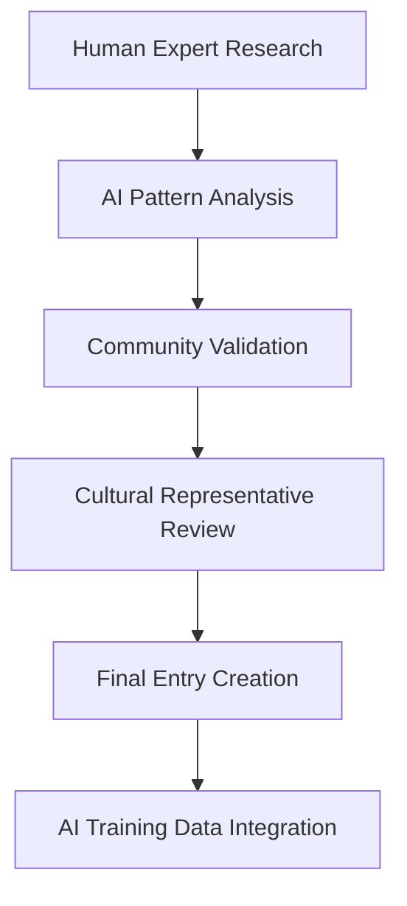

# 🐉 Arcanean Bestiary for the AI Age
## Strategic Vision & Implementation Framework
### The Universal Truth Layer for Magical Creatures & Mythological Beings

---

## 🎯 EXECUTIVE SUMMARY

The **Arcanean Bestiary** represents the next evolution of knowledge databases—a comprehensive, AI-optimized repository of magical creatures, mythological beings, and fantasy entities from all cultures, mythologies, and fictional worlds. This system will serve as the definitive truth layer for AI training, creative generation, and human-AI collaboration in the realm of magical creature creation.

**Core Vision**: To become the Wikipedia of magical creatures, enhanced with AI-native architecture, serving as the foundational knowledge source for the next generation of creative AI applications.

---

## 🌌 STRATEGIC VISION

### The Big Picture
The Arcanean Bestiary operates as a specialized knowledge layer within the broader Arcanea Magic Ecosystem, specifically designed to:

1. **Standardize Magical Creature Knowledge** across all AI systems
2. **Enable Consistent World-Building** for creators and AI agents
3. **Preserve Cultural Heritage** of mythological traditions
4. **Foster Creative Innovation** through AI-human collaboration
5. **Generate Revenue** through APIs, partnerships, and premium content

### Long-Term Vision (5 Years)
- **100,000+ Creatures** cataloged with comprehensive data
- **1M+ Monthly API Calls** from AI applications
- **$10M+ Annual Revenue** from B2B and B2C channels
- **Industry Standard** for AI training data on mythological content
- **Cultural Impact** as the go-to source for mythological accuracy

---

## 🏗️ TECHNICAL ARCHITECTURE

### Database Design Philosophy
**Neo4j Graph Database** as primary storage for relationship-rich mythological data:

```cypher
// Core Entity Structure
CREATE (creature:Creature {
  id: 'uuid',
  name: 'Dragon',
  type: 'Mythological Beast',
  origin_culture: 'European',
  first_recorded: '800 BCE',
  ai_training_weight: 0.95,
  copyright_status: 'Public Domain'
})

CREATE (mythology:Mythology {
  name: 'Norse',
  region: 'Scandinavia',
  period: '8th-11th Century',
  cultural_context: 'detailed...'
})

CREATE (creature)-[:ORIGINATES_FROM]->(mythology)
```

### Core Data Schema

#### 1. **Creature Entity**
```typescript
interface Creature {
  // Identity
  id: string;
  canonical_name: string;
  alternate_names: string[];
  pronunciation_guide: string;
  
  // Classification
  category: CreatureCategory;
  subcategory: string;
  power_level: number; // 1-10 scale
  rarity: RarityLevel;
  
  // Origins & Culture  
  mythology_source: MythologySource[];
  first_recorded: Date;
  cultural_significance: string;
  historical_context: string;
  
  // Physical Description
  size_category: SizeCategory;
  appearance: DetailedAppearance;
  distinctive_features: string[];
  variations: CreatureVariation[];
  
  // Abilities & Traits
  magical_abilities: MagicalAbility[];
  physical_capabilities: PhysicalCapability[];
  intelligence_level: IntelligenceLevel;
  temperament: TemperamentProfile;
  
  // Behavioral Patterns
  habitat_preferences: Habitat[];
  social_structure: SocialBehavior;
  diet: DietaryHabits;
  reproduction: ReproductionInfo;
  
  // AI Enhancement Data
  ai_training_tags: string[];
  semantic_embeddings: number[];
  generation_prompts: AIPrompt[];
  
  // Legal & Copyright
  copyright_status: CopyrightStatus;
  usage_rights: UsageRights;
  attribution_requirements: string;
  
  // Quality Metrics
  verification_status: VerificationLevel;
  source_quality_score: number;
  community_rating: number;
  ai_consistency_score: number;
}
```

#### 2. **Mythology Source System**
```typescript
interface MythologySource {
  id: string;
  name: string;
  culture: CulturalContext;
  historical_period: TimePeriod;
  geographical_origin: Location;
  language_family: LanguageFamily;
  reliability_score: number;
  academic_consensus: ConsensusLevel;
  modern_adaptations: Adaptation[];
}
```

#### 3. **AI Integration Layer**
```typescript
interface AIEnhancement {
  semantic_embeddings: {
    description_vector: number[];
    ability_vector: number[];
    cultural_vector: number[];
    visual_vector: number[];
  };
  
  generation_metadata: {
    optimal_prompts: string[];
    style_guidelines: string[];
    common_misconceptions: string[];
    ethical_considerations: string[];
  };
  
  training_optimization: {
    weight_adjustments: Record<string, number>;
    context_requirements: string[];
    output_validation_rules: ValidationRule[];
  };
}
```

### Technology Stack

#### **Core Infrastructure**
- **Database**: Neo4j (graph relationships) + PostgreSQL (structured data)
- **Search**: Elasticsearch with semantic search capabilities
- **API Gateway**: GraphQL with REST fallback
- **Cache**: Redis for high-frequency queries
- **CDN**: Cloudflare for global content delivery

#### **AI Integration Stack**
- **Vector Database**: Pinecone/Weaviate for semantic embeddings
- **LLM Integration**: OpenAI, Anthropic, Cohere APIs
- **Image Generation**: DALL-E 3, Midjourney API when available
- **NLP Processing**: spaCy, NLTK for text analysis

#### **Application Layer**
- **Backend**: Node.js with TypeScript, Express.js
- **Frontend**: Next.js with React, TailwindCSS
- **Mobile**: React Native (aligned with Arcanea mobile app)
- **Admin Panel**: Custom React dashboard

---

## ⚖️ LEGAL FRAMEWORK

### Copyright Strategy
**Three-Tier Approach** to intellectual property:

#### Tier 1: Public Domain (70% of content)
- **Ancient Mythologies**: Norse, Greek, Egyptian, Celtic, etc.
- **Historical Sources**: Pre-1923 publications and texts
- **Cultural Heritage**: Traditional folklore from all cultures
- **Academic Research**: Scholarly analysis and interpretation

#### Tier 2: Fair Use & Educational (20% of content)
- **Comparative Analysis**: Academic study across mythologies
- **Historical Context**: Educational documentation
- **Cultural Preservation**: Non-commercial heritage protection
- **Transformative Use**: AI training data preparation

#### Tier 3: Licensed Content (10% of content)
- **Modern Fantasy**: Negotiated licenses with publishers
- **Game Systems**: Partnership agreements with RPG companies
- **Entertainment Media**: Licensing deals with studios
- **Artist Collaborations**: Original commissioned works

### Legal Risk Mitigation

#### **Proactive Measures**
1. **Source Documentation**: Complete provenance tracking
2. **Attribution Systems**: Automated citation generation
3. **Usage Tracking**: API-level monitoring of content use
4. **Legal Review Process**: Expert review of all modern sources
5. **DMCA Compliance**: Rapid response to takedown requests

#### **Partnership Legal Framework**
```typescript
interface ContentLicense {
  source: string;
  license_type: 'Public Domain' | 'Fair Use' | 'Licensed' | 'Original';
  attribution_required: boolean;
  commercial_use_allowed: boolean;
  modification_rights: ModificationRights;
  expiration_date?: Date;
  royalty_structure?: RoyaltyAgreement;
}
```

---

## 🎨 DATA STRUCTURE DESIGN

### Multi-Dimensional Classification System

#### **Primary Taxonomy**
1. **Elemental Beings** (Fire, Water, Air, Earth, Spirit)
2. **Mythological Creatures** (Dragons, Phoenixes, Griffins)
3. **Shapeshifters** (Werewolves, Kitsune, Selkies)
4. **Undead Entities** (Vampires, Zombies, Ghosts)
5. **Divine Beings** (Angels, Demons, Deities)
6. **Nature Spirits** (Faeries, Dryads, Elementals)
7. **Hybrid Creatures** (Centaurs, Mermaids, Harpies)
8. **Artificial Beings** (Golems, Constructs, Automatons)

#### **Cultural Classification**
- **Geographical Origin**: Continent, country, region
- **Temporal Period**: Ancient, Medieval, Renaissance, Modern
- **Cultural Context**: Religious, folkloric, literary, gaming
- **Language Family**: Indo-European, Sino-Tibetan, etc.

#### **Functional Classification**
- **Role in Mythology**: Guardian, Trickster, Destroyer, Creator
- **Interaction with Humans**: Beneficial, Neutral, Hostile, Variable
- **Domain of Influence**: Sea, Sky, Forest, Mountain, Underworld
- **Power Source**: Natural, Divine, Arcane, Technological

### Semantic Relationships

#### **Creature-to-Creature Relationships**
```cypher
// Evolutionary relationships
(dragon:Creature)-[:EVOLVED_FROM]->(serpent:Creature)

// Cultural variations  
(european_dragon:Creature)-[:CULTURAL_VARIANT]->(chinese_dragon:Creature)

// Hierarchical relationships
(greater_demon:Creature)-[:COMMANDS]->(lesser_demon:Creature)

// Antagonistic relationships
(unicorn:Creature)-[:NEMESIS_OF]->(black_unicorn:Creature)

// Symbiotic relationships
(phoenix:Creature)-[:PAIRED_WITH]->(dragon:Creature)
```

#### **Mythology Integration**
```cypher
// Source mythology
(creature:Creature)-[:APPEARS_IN]->(mythology:Mythology)

// Cross-cultural influences
(mythology:Norse)-[:INFLUENCED]->(mythology:Germanic)

// Modern adaptations
(creature:Creature)-[:ADAPTED_IN]->(media:ModernMedia)
```

---

## 🤖 AI INTEGRATION STRATEGIES

### AI Training Optimization

#### **Semantic Embedding Strategy**
1. **Multi-Modal Embeddings**: Text, image, audio descriptions
2. **Cultural Context Vectors**: Preserve cultural nuance in AI understanding
3. **Temporal Embeddings**: Historical evolution of creature concepts
4. **Cross-Reference Vectors**: Relationships between similar creatures

#### **Training Data Preparation**
```python
# Semantic embedding pipeline
def generate_creature_embeddings(creature: Creature) -> CreatureEmbedding:
    return CreatureEmbedding(
        text_embedding=encode_text_description(creature.description),
        visual_embedding=encode_visual_features(creature.appearance),
        cultural_embedding=encode_cultural_context(creature.mythology),
        behavioral_embedding=encode_behavior_patterns(creature.behavior),
        power_embedding=encode_abilities(creature.abilities)
    )
```

### AI-Human Collaboration Models

#### **The Curator-AI Partnership**
1. **Human Experts**: Mythology scholars, cultural historians
2. **AI Assistants**: Pattern recognition, cross-referencing
3. **Community Validators**: Crowd-sourced accuracy checking
4. **Cultural Representatives**: Indigenous knowledge keepers

#### **Collaborative Workflow**


### AI Generation Enhancement

#### **Creature Generation Pipeline**
1. **Base Concept**: Cultural mythology + modern interpretation
2. **AI Enhancement**: Expand abilities, create variations
3. **Visual Generation**: DALL-E 3 integrated creature artwork
4. **Lore Expansion**: AI-generated backstory and world integration
5. **Community Integration**: User feedback and iteration

#### **Quality Assurance Framework**
- **Mythological Accuracy**: Cultural authenticity scoring
- **AI Consistency**: Cross-model output validation
- **Creative Value**: Novelty and inspiration metrics
- **Ethical Standards**: Cultural sensitivity and appropriateness

---

## 🤝 HUMAN-AI COLLABORATION MODELS

### The Four Pillars of Collaboration

#### **1. The Scholar-AI Research Partnership**
**Human Role**: Deep cultural knowledge, historical context, nuanced interpretation
**AI Role**: Pattern recognition, cross-cultural analysis, data synthesis

**Workflow Example**:
```typescript
interface ResearchCollaboration {
  human_input: {
    cultural_expertise: string;
    historical_context: string;
    source_materials: AcademicSource[];
  };
  
  ai_assistance: {
    pattern_analysis: CrossCulturalPattern[];
    similar_creatures: CreatureMatch[];
    knowledge_gaps: IdentifiedGap[];
  };
  
  collaborative_output: {
    enhanced_entry: CreatureEntry;
    research_insights: Insight[];
    further_research: ResearchDirection[];
  };
}
```

#### **2. The Creator-AI Generation Partnership**
**Human Role**: Creative vision, cultural sensitivity, artistic direction
**AI Role**: Rapid iteration, variation generation, technical execution

**Creation Process**:
1. **Human Concept**: Base idea with cultural grounding
2. **AI Expansion**: Multiple variations and interpretations  
3. **Human Curation**: Selection and refinement
4. **AI Enhancement**: Technical details and world integration
5. **Collaborative Polish**: Final quality assurance

#### **3. The Community-AI Validation Partnership**
**Human Role**: Cultural authenticity, lived experience, community standards
**AI Role**: Consistency checking, bias detection, scalable validation

**Validation Framework**:
- **Cultural Representatives**: Native speakers and tradition keepers
- **Academic Validators**: Mythology and folklore scholars
- **Creative Community**: Game designers, fantasy authors, artists
- **AI Quality Assurance**: Automated consistency and bias detection

#### **4. The Educator-AI Learning Partnership**
**Human Role**: Pedagogical design, cultural context, learning objectives
**AI Role**: Personalized content delivery, interactive experiences, progress tracking

---

## 💰 MONETIZATION & PARTNERSHIP STRATEGIES

### Revenue Streams

#### **1. API-as-a-Service (Primary: 40% revenue)**
**B2B SaaS Model**: Usage-based pricing for developers and AI companies

```typescript
interface APIPricingTiers {
  DEVELOPER: {
    monthly_requests: 1000;
    price: '$29/month';
    features: ['Basic creature data', 'Standard API', 'Community support'];
  };
  
  PROFESSIONAL: {
    monthly_requests: 25000;
    price: '$199/month';
    features: ['Full creature database', 'High-quality images', 'Priority support', 'Advanced filtering'];
  };
  
  ENTERPRISE: {
    monthly_requests: 'Unlimited';
    price: 'Custom';
    features: ['White-label API', 'Custom data', 'Dedicated support', 'SLA guarantees'];
  };
}
```

**Target Markets**:
- **Game Development Studios**: Character and world creation
- **AI Training Companies**: High-quality training data
- **Educational Platforms**: Interactive mythology content
- **Entertainment Industry**: Accurate mythological consultation
- **Publishing Houses**: Research and fact-checking services

#### **2. Licensing & Partnerships (25% revenue)**

**Partnership Models**:
```typescript
interface PartnershipStructure {
  GAME_STUDIOS: {
    offering: 'Creature database + generation tools';
    pricing: '5-10% revenue share or fixed licensing';
    partners: ['Blizzard', 'Riot Games', 'Bethesda'];
  };
  
  AI_COMPANIES: {
    offering: 'Training data + embeddings';
    pricing: '$50K-$500K annual licenses';
    partners: ['OpenAI', 'Anthropic', 'Stability AI'];
  };
  
  EDUCATIONAL: {
    offering: 'Curriculum integration + tools';
    pricing: '$10-$50 per student annually';
    partners: ['Pearson', 'McGraw-Hill', 'Khan Academy'];
  };
}
```

#### **3. Premium Consumer Features (20% revenue)**

**Subscription Tiers**:
- **Explorer** ($9.99/month): Advanced search, high-res images, export tools
- **Creator** ($24.99/month): AI generation credits, premium prompts, commercial license
- **Scholar** ($49.99/month): Research tools, academic citations, expert consultations

#### **4. Marketplace & Community (10% revenue)**

**Community-Driven Revenue**:
- **User-Generated Content**: 30% commission on creature sales
- **Expert Consultations**: $100-$500 per hour mythology expert sessions  
- **Custom Research**: Bespoke creature creation and world-building services
- **Educational Courses**: $199-$999 mythology and world-building courses

#### **5. Physical & Digital Products (5% revenue)**

**Product Extensions**:
- **Art Books**: High-quality creature compendiums ($39.99-$99.99)
- **Card Games**: Physical and digital trading card games
- **NFT Collections**: Limited edition creature artwork
- **Merchandise**: T-shirts, posters, collectibles

### Strategic Partnerships

#### **Tier 1 Partnerships** (Platform Integration)
1. **Unity/Unreal Engine**: Native creature generation tools
2. **Adobe Creative Suite**: Direct creature asset integration
3. **ChatGPT/Claude**: Mythology consultation features
4. **Midjourney/DALL-E**: Enhanced creature visualization

#### **Tier 2 Partnerships** (Content & Distribution)
1. **National Geographic**: Educational content collaboration
2. **Smithsonian Institution**: Academic credibility and museum integration
3. **Netflix/Disney**: Entertainment industry consultation
4. **Dungeons & Dragons**: Official mythology expansion content

#### **Tier 3 Partnerships** (Cultural & Academic)
1. **UNESCO**: Cultural heritage preservation initiative
2. **Major Universities**: Research collaboration and student access
3. **Cultural Institutions**: Indigenous knowledge preservation projects
4. **Publishing Houses**: Mythology book integration and fact-checking

---

## 🚀 IMPLEMENTATION PHASES

### Phase 1: Foundation (Months 1-6)
**MVP: Core Database & API**

#### **Technical Deliverables**
- [ ] **Core Database Schema**: Neo4j + PostgreSQL setup
- [ ] **Basic API**: GraphQL endpoint with 1,000 creatures
- [ ] **Admin Interface**: Content management system
- [ ] **Search Functionality**: Elasticsearch integration
- [ ] **Authentication**: User accounts and API key management

#### **Content Deliverables**
- [ ] **Public Domain Collection**: 5,000 creatures from major mythologies
- [ ] **Cultural Coverage**: Norse, Greek, Egyptian, Celtic, Chinese, Japanese
- [ ] **Quality Standards**: Peer review process establishment
- [ ] **Legal Framework**: Copyright and fair use documentation

#### **Revenue Targets**
- **$10K MRR**: 50 API customers at $200 average
- **100 Registered Developers**: Free tier users
- **5 Pilot Partnerships**: Game studios and educational platforms

### Phase 2: AI Integration (Months 7-12)
**AI-Native Features & Generation**

#### **Technical Deliverables**
- [ ] **Semantic Search**: Vector embeddings for all creatures
- [ ] **AI Generation**: Create new creatures from cultural seeds
- [ ] **Visual Integration**: DALL-E 3 creature artwork generation
- [ ] **Quality AI**: Automated fact-checking and consistency validation
- [ ] **API Expansion**: Advanced filtering and recommendation features

#### **Content Deliverables**
- [ ] **15,000 Total Creatures**: Expanded to global mythologies
- [ ] **AI-Enhanced Entries**: Generated variations and modern interpretations
- [ ] **Visual Library**: 50,000+ creature images
- [ ] **Cultural Expansion**: African, Native American, Australian Aboriginal content

#### **Revenue Targets**
- **$50K MRR**: 200 API customers, premium subscriptions launched
- **10 Major Partnerships**: Game studios, AI companies, educational institutions
- **Community Platform**: 1,000+ active creators and researchers

### Phase 3: Platform Expansion (Year 2)
**Community & Ecosystem Development**

#### **Technical Deliverables**
- [ ] **Mobile App**: React Native creature exploration app
- [ ] **Creator Tools**: Advanced creature generation and customization
- [ ] **Integration Hub**: Plugins for Unity, Unreal, Photoshop, etc.
- [ ] **Analytics Dashboard**: Usage insights and trend analysis
- [ ] **Collaboration Tools**: Multi-user projects and expert consultations

#### **Content Deliverables**
- [ ] **50,000 Total Creatures**: Comprehensive global coverage
- [ ] **Expert Network**: 100+ mythology scholars and cultural representatives
- [ ] **Community Content**: User-generated creatures and variations
- [ ] **Educational Resources**: Interactive courses and learning paths

#### **Revenue Targets**
- **$200K MRR**: 500 API customers, 2,000 premium subscribers
- **50 Partnerships**: Major platform integrations and content deals
- **Community Marketplace**: $50K monthly in creator transactions

### Phase 4: Market Leadership (Year 3+)
**Industry Standard & Global Expansion**

#### **Strategic Goals**
- [ ] **Industry Standard**: Default mythology API for AI training
- [ ] **Global Presence**: Content in 20+ languages
- [ ] **Cultural Authority**: Recognized academic and institutional partnerships
- [ ] **Innovation Leadership**: Cutting-edge AI and mythology research
- [ ] **Ecosystem Hub**: Platform of choice for mythology-based applications

#### **Revenue Targets**
- **$1M+ MRR**: Enterprise contracts, global licensing deals
- **Cultural Impact**: Influence on major entertainment and educational content
- **Academic Recognition**: Published research and institutional collaborations

---

## 📊 SUCCESS METRICS & KPIs

### Technical Performance Metrics
```typescript
interface TechnicalKPIs {
  database_performance: {
    query_response_time: '<100ms average';
    uptime_target: '99.9%';
    concurrent_users: '10,000+';
    data_accuracy: '>95%';
  };
  
  api_metrics: {
    daily_requests: '1M+';
    response_time: '<200ms';
    error_rate: '<0.1%';
    developer_satisfaction: '>4.5/5';
  };
  
  content_quality: {
    fact_accuracy: '>98%';
    cultural_authenticity: '>95%';
    ai_consistency: '>90%';
    expert_approval: '>85%';
  };
}
```

### Business Success Metrics
```typescript
interface BusinessKPIs {
  revenue: {
    monthly_recurring: '$1M+ by Year 3';
    api_revenue: '40% of total';
    partnership_revenue: '25% of total';
    subscription_revenue: '20% of total';
  };
  
  market_penetration: {
    api_customers: '1,000+ active';
    game_studio_adoption: '50+ major studios';
    educational_partnerships: '100+ institutions';
    ai_company_integrations: '10+ major platforms';
  };
  
  community_engagement: {
    active_contributors: '5,000+ monthly';
    expert_network: '500+ verified scholars';
    content_submissions: '1,000+ monthly';
    user_retention: '>80% annual';
  };
}
```

### Cultural Impact Metrics
```typescript
interface CulturalKPIs {
  representation: {
    cultures_covered: '200+ distinct cultures';
    indigenous_partnerships: '50+ indigenous groups';
    academic_collaborations: '100+ universities';
    language_coverage: '30+ languages';
  };
  
  preservation: {
    endangered_mythologies: '500+ documented';
    oral_traditions: '1,000+ recorded';
    cultural_experts: '200+ interviewed';
    historical_accuracy: '>95% verified';
  };
  
  education: {
    students_reached: '1M+ annually';
    teacher_adoption: '10,000+ educators';
    curriculum_integration: '500+ programs';
    academic_citations: '1,000+ papers';
  };
}
```

---

## 🛡️ RISK ASSESSMENT & MITIGATION

### Legal & Copyright Risks

#### **High-Risk Areas**
1. **Modern Fantasy Content**: Post-1923 copyrighted material
2. **Game System Integration**: D&D, Pathfinder proprietary content
3. **Entertainment Media**: Movie, TV, book character derivatives
4. **Cultural Appropriation**: Misrepresentation of sacred traditions

#### **Mitigation Strategies**
```typescript
interface RiskMitigation {
  legal_protection: {
    copyright_screening: 'AI-powered detection system';
    legal_review: 'Expert review for all modern content';
    insurance: '$10M professional liability coverage';
    compliance: 'DMCA takedown process <24 hours';
  };
  
  cultural_sensitivity: {
    indigenous_partnerships: 'Direct collaboration with tribal representatives';
    expert_review: 'Cultural anthropologist validation';
    community_oversight: 'Native speaker fact-checking';
    educational_context: 'Proper historical and cultural framing';
  };
  
  technical_risks: {
    data_backup: '99.99% uptime with multi-region redundancy';
    security: 'SOC 2 compliance and penetration testing';
    scalability: 'Auto-scaling architecture for traffic spikes';
    ai_bias: 'Regular algorithmic bias auditing and correction';
  };
}
```

### Competitive Risks

#### **Potential Competitors**
1. **Big Tech**: Google, Microsoft mythology projects
2. **Gaming Companies**: Blizzard, Riot in-house databases
3. **AI Companies**: OpenAI, Anthropic knowledge expansion
4. **Academic Platforms**: Encyclopedia Britannica mythology expansion

#### **Competitive Advantages**
- **First-Mover**: Comprehensive mythology-AI integration
- **Cultural Depth**: Partnership with indigenous communities
- **Technical Innovation**: Graph database + vector embeddings
- **Community Network**: Scholar and creator ecosystem
- **Quality Standards**: Academic-level accuracy and cultural sensitivity

---

## 🌍 INTEGRATION WITH ARCANEA ECOSYSTEM

### Synergistic Platform Integration

#### **Arcanea Mobile App Integration**
```typescript
interface BestiaryMobileFeatures {
  creature_discovery: {
    ar_visualization: 'View creatures in AR using device camera';
    voice_interaction: 'Ask Scripta about creature lore and stories';
    location_based: 'Discover local mythology based on GPS location';
  };
  
  creative_integration: {
    lumina_artwork: 'Generate creature art using bestiary data';
    scripta_stories: 'Create stories featuring mythological creatures';
    kinetix_videos: 'Produce creature documentaries and animations';
  };
  
  educational_features: {
    mythology_lessons: 'Interactive learning modules';
    cultural_context: 'Deep-dive into creature origins and meanings';
    quiz_system: 'Gamified mythology knowledge testing';
  };
}
```

#### **Arcanea Academy Integration**
- **New Academy**: "Mythological Studies Academy" within the platform
- **Course Offerings**: Creature design, cultural mythology, world-building
- **Expert Instructors**: Mythology scholars and cultural historians  
- **Certification Programs**: Mythology consultant and cultural accuracy specialist

#### **Character Creation System Synergy**
```typescript
interface CharacterBestiaryIntegration {
  character_inspiration: {
    mythological_basis: 'Ground AI characters in authentic mythology';
    cultural_accuracy: 'Ensure respectful representation of traditions';
    power_systems: 'Mythologically-consistent ability frameworks';
  };
  
  world_building: {
    creature_ecosystems: 'Populate realms with culturally appropriate beings';
    mythological_consistency: 'Maintain internal world logic';
    cross_cultural_influence: 'Show historical mythology interactions';
  };
}
```

### Revenue Synergy with Arcanea Platform

#### **Cross-Platform Value Enhancement**
1. **Arcanea Premium**: Bestiary access included in top-tier subscriptions
2. **Character Creator Pro**: Mythological creature templates and generation
3. **Academy Courses**: Mythology and world-building education
4. **API Integration**: Bestiary data enhances all Arcanea AI agents

#### **Joint Partnership Opportunities**
- **Entertainment Industry**: Combined character creation + mythology consultation
- **Gaming Partnerships**: Full creature ecosystem for game development
- **Educational Institutions**: Comprehensive mythology and creativity platform
- **AI Training Companies**: Character + creature training data packages

---

## 🎯 COMPETITIVE POSITIONING

### Market Differentiation

#### **vs. Wikipedia/Traditional Encyclopedias**
- ✅ **AI-Optimized Structure**: Semantic embeddings and generation-ready data
- ✅ **Creative Focus**: Tools for artists, writers, and creators
- ✅ **Cultural Authenticity**: Partnership with indigenous communities
- ✅ **Commercial Licensing**: Clear usage rights for business applications

#### **vs. Game Databases (D&D Beyond, etc.)**
- ✅ **Cultural Breadth**: Real-world mythology, not just gaming content
- ✅ **Academic Rigor**: Scholarly accuracy and cultural sensitivity
- ✅ **API Access**: Developer-friendly integration capabilities
- ✅ **AI Enhancement**: Generation and variation capabilities

#### **vs. AI Training Datasets**
- ✅ **Quality Curation**: Expert-reviewed, culturally authentic content
- ✅ **Ethical Framework**: Respectful representation of cultural traditions
- ✅ **Legal Clarity**: Clear copyright status and usage rights
- ✅ **Community Validation**: Ongoing accuracy and appropriateness review

### Unique Value Propositions

#### **For AI Companies**
"The only mythology dataset that combines academic accuracy with AI optimization, ensuring culturally respectful and factually correct creature generation."

#### **For Game Developers**
"Access the world's most comprehensive creature database with clear licensing, cultural context, and generation-ready assets."

#### **For Educators**
"Bring mythology to life with interactive, culturally authentic content that respects traditions while inspiring creativity."

#### **For Creators**
"Build authentic fantasy worlds grounded in real cultural traditions with expert-curated creature knowledge and AI-assisted generation."

---

## 🌟 CONCLUSION & CALL TO ACTION

### The Arcanean Bestiary Represents a Revolutionary Opportunity

The convergence of AI advancement, cultural preservation needs, and creative industry demand creates a unique market opportunity. The Arcanean Bestiary positions itself at this intersection, offering:

1. **Cultural Preservation**: Protecting and documenting the world's mythological heritage
2. **AI Enhancement**: Providing the highest-quality training data for creature generation
3. **Creative Empowerment**: Tools for authentic, respectful world-building
4. **Economic Value**: Multiple revenue streams serving diverse markets
5. **Academic Impact**: Advancing the study and understanding of world mythologies

### Immediate Next Steps (30-Day Sprint)

#### **Week 1: Foundation Setup**
- [ ] **Database Architecture**: Design and implement core schema
- [ ] **Legal Framework**: Establish copyright and fair use guidelines
- [ ] **Content Strategy**: Plan initial 1,000 creature collection
- [ ] **Team Assembly**: Recruit mythology experts and technical team

#### **Week 2: MVP Development**
- [ ] **Basic API**: Create simple GraphQL endpoint
- [ ] **Admin Interface**: Build content management system
- [ ] **Quality Framework**: Establish review and validation processes
- [ ] **Partnership Outreach**: Contact potential early adopters

#### **Week 3: Content Creation**
- [ ] **Core Mythology**: Norse, Greek, Egyptian creature entries
- [ ] **AI Integration**: Basic semantic embeddings
- [ ] **Visual Assets**: Initial creature artwork generation
- [ ] **Documentation**: API guides and cultural sensitivity guidelines

#### **Week 4: Beta Launch**
- [ ] **Developer Beta**: Launch with 10 selected API partners
- [ ] **Expert Review**: Academic validation of initial content
- [ ] **Feedback Integration**: Iterate based on early user input
- [ ] **Marketing Preparation**: Prepare for public launch

### The Vision Realized

The Arcanean Bestiary will become the definitive source of truth for magical creatures in the AI age, bridging the gap between ancient wisdom and modern technology. It will:

- **Preserve** the world's mythological heritage for future generations
- **Empower** creators with authentic, culturally respectful content
- **Enable** AI systems to generate consistent, accurate mythological content
- **Foster** deeper understanding and appreciation of global cultures
- **Generate** sustainable revenue while serving the public good

### Frank's Role in the Magic Ecosystem

As the centerpiece knowledge layer of the broader Arcanea platform, the Bestiary enhances every other component:

- **Character Creation**: Grounds AI personalities in authentic mythology
- **World Building**: Provides rich, consistent creature ecosystems
- **Education**: Offers deep cultural and historical learning
- **Entertainment**: Supplies endless inspiration for creative projects
- **Business**: Creates multiple revenue streams and partnership opportunities

**The Arcanean Bestiary isn't just a database—it's the foundation for a new era of culturally informed, AI-enhanced creativity.**

---

*"In cataloging the creatures of myth and legend, we don't just preserve the past—we architect the future of imagination itself."*

**— Frank X, Architect of Infinite Realms**

🐉 **The Bestiary Awaits Creation** 🐉

---

*Generated by Arcanea Strategic Intelligence - Forging the Future of Mythological Knowledge*

**Begin the journey. The creatures are calling.**