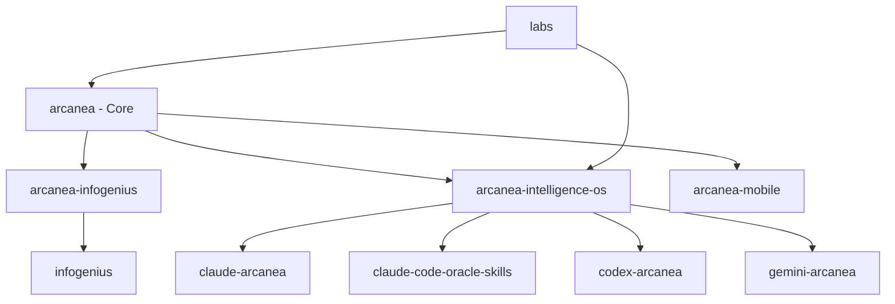

# Arcanea Ecosystem - Repository Architecture

> *"Unity through diversity. One vision, many manifestations."*

## 🌟 The Arcanean Repository Universe

Your work has been scattered across 18+ repositories. This document maps the ecosystem and proposes an interconnection strategy.

---

## 📊 Current Repository Inventory

### 🏛️ **Core Arcanea Projects** (Your Primary Work)

| Repository | Purpose | Status | URL |
|-----------|---------|--------|-----|
| **arcanea** | Main ecosystem hub | ✅ Pushed | [github.com/frankxai/arcanea](https://github.com/frankxai/arcanea) |
| **arcanea-infogenius** | Information intelligence system | ✅ Pushed | [github.com/frankxai/arcanea-infogenius](https://github.com/frankxai/arcanea-infogenius) |
| **arcanea-intelligence-os** | Operating system for AI | ✅ Pushed | [github.com/frankxai/arcanea-intelligence-os](https://github.com/frankxai/arcanea-intelligence-os) |
| **arcanea-mobile** | Mobile app development | ✅ Pushed | [github.com/frankxai/arcanea-mobile](https://github.com/frankxai/arcanea-mobile) |

### 🔮 **AI Platform Integrations**

| Repository | Platform | Purpose | Status | URL |
|-----------|----------|---------|--------|-----|
| **claude-arcanea** | Claude | Claude Code integration | ✅ Pushed | [github.com/frankxai/claude-arcanea](https://github.com/frankxai/claude-arcanea) |
| **claude-code-oracle-skills** | Claude | Oracle skills for Claude Code | ✅ Pushed | [github.com/frankxai/claude-code-oracle-skills](https://github.com/frankxai/claude-code-oracle-skills) |
| **codex-arcanea** | OpenAI | Codex integration | ✅ Pushed | [github.com/frankxai/codex-arcanea](https://github.com/frankxai/codex-arcanea) |
| **gemini-arcanea** | Google | Gemini integration | ✅ Pushed | [github.com/frankxai/gemini-arcanea](https://github.com/frankxai/gemini-arcanea) |

### 🧪 **Research & Labs**

| Repository | Purpose | Owner | Status | URL |
|-----------|---------|-------|--------|-----|
| **labs** | Arcanea Labs - experimental work | Arcanea-Labs org | ✅ Pushed | [github.com/Arcanea-Labs/Arcanea](https://github.com/Arcanea-Labs/Arcanea) |
| **infogenius** | Information genius system | ✅ Pushed | [github.com/frankxai/infogenius](https://github.com/frankxai/infogenius) |
| **arcaneabot** | Bot framework | moltbot org | ⚠️ Not yours | [github.com/moltbot/moltbot](https://github.com/moltbot/moltbot) |

### 🎮 **Game Development Research** (External Forks/Clones)

| Repository | Source | Status |
|-----------|--------|--------|
| drei-components-research | react-spring/drei | Clean - research only |
| next-games-research | vercel/next.js | ⚠️ 26K+ uncommitted changes |
| phaser-nextjs-template | phaserjs/template-nextjs | Clean - template |
| three-fiber-research | pmndrs/react-three-fiber | Clean - research only |

### 🔧 **External/Third-Party**

| Repository | Purpose | Status |
|-----------|---------|--------|
| Nano-Banana-MCP | ConechoAI project | ⚠️ Fork/dependency |
| oci-ai-architect-skills | OCI AI Architects | External |

---

## 🏗️ Proposed Interconnection Strategies

### **Option 1: Mono-Repo with Git Submodules** ⭐ RECOMMENDED

Create one master repo that contains all your projects as submodules:

```
arcanea-ecosystem/ (master repo)
├── arcanea/ (submodule)
├── arcanea-infogenius/ (submodule)
├── arcanea-intelligence-os/ (submodule)
├── arcanea-mobile/ (submodule)
├── claude-arcanea/ (submodule)
├── claude-code-oracle-skills/ (submodule)
├── codex-arcanea/ (submodule)
├── gemini-arcanea/ (submodule)
├── infogenius/ (submodule)
└── labs/ (submodule - from Arcanea-Labs)
```

**Pros:**
- Single `git clone --recursive` gets everything
- Each repo remains independent
- Can version-lock dependencies
- Clear dependency graph

**Cons:**
- More complex git commands
- Submodule updates require extra steps

---

### **Option 2: Meta-Repo with Scripts**

Create an index repo that just tracks all repos:

```
arcanea-meta/
├── README.md (this doc)
├── repos.json (machine-readable list)
├── repos.yaml (human-readable config)
├── scripts/
│   ├── clone-all.sh (clone everything)
│   ├── sync-all.sh (pull all updates)
│   └── status-all.sh (check all repos)
└── .github/
    └── workflows/
        └── sync-all.yml (automated sync)
```

**Pros:**
- Simple, no git complexity
- Can add automation easily
- Great for CI/CD orchestration

**Cons:**
- No true code linking
- Must run scripts to sync

---

### **Option 3: GitHub Organization Migration**

Move everything to a single GitHub organization:

```
https://github.com/Arcanea-Project/
├── arcanea (main)
├── infogenius
├── intelligence-os
├── mobile
├── integrations/
│   ├── claude
│   ├── codex
│   └── gemini
└── labs
```

**Pros:**
- Professional appearance
- Centralized access control
- GitHub organization features

**Cons:**
- Breaking change (URLs change)
- Requires org setup

---

## 🎯 Recommended Next Steps

### **Phase 1: Immediate (Today)**
1. ✅ **COMPLETE** - Push all repos (done!)
2. Choose interconnection strategy
3. Create the master index

### **Phase 2: This Week**
1. Implement chosen strategy
2. Add sync scripts
3. Document the architecture

### **Phase 3: This Month**
1. Add GitHub Actions for automated sync
2. Create dependency graph
3. Set up cross-repo issue tracking

---

## 🔗 Cross-Repo Dependencies



---

## 📋 Repository Sync Commands

### Clone Everything
```bash
# Using submodules (after setup)
git clone --recursive https://github.com/frankxai/arcanea-ecosystem.git

# Using scripts
./scripts/clone-all.sh
```

### Sync All Repos
```bash
# Pull latest from all
./scripts/sync-all.sh

# Check status of all
./scripts/status-all.sh
```

---

## 🎓 Decision Matrix

| Factor | Submodules | Meta-Repo | Organization |
|--------|-----------|-----------|--------------|
| Complexity | Medium | Low | Low |
| Flexibility | High | Medium | Low |
| Maintenance | Medium | Low | Low |
| Team Scaling | Good | Good | Excellent |
| CI/CD Support | Good | Good | Excellent |
| **Recommendation** | **✅ YES** | Alternative | Future |

---

## 💡 Recommendation

**Use Option 1 (Submodules)** for these reasons:

1. **You already have 18 repos** - consolidating would be destructive
2. **Different purposes** - game research vs. AI integrations vs. core system
3. **Version locking** - submodules let you pin specific versions
4. **Future flexibility** - easy to add/remove projects
5. **Industry standard** - used by Linux, Android, many large projects

**Create:** `arcanea-ecosystem` as the master repo with all others as submodules.

---

*Generated: 2026-01-31*  
*Status: All repos synced and ready for interconnection*
