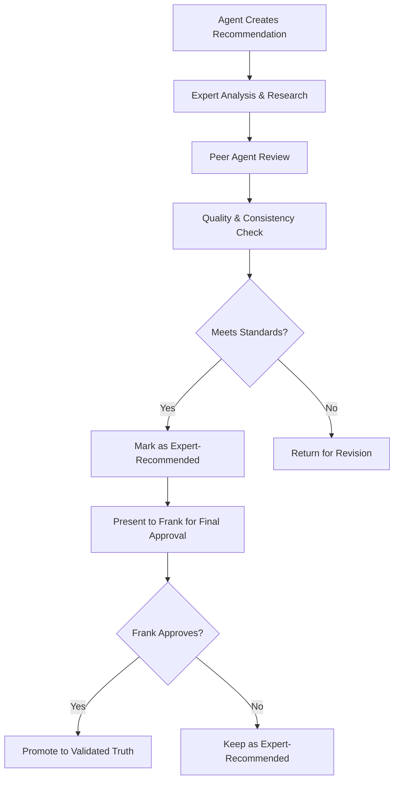

# 📚 ARCANEA KNOWLEDGE BASE MANAGEMENT SYSTEM
## Creating Validated Truth in the Age of AI

<philosophy>
**Core Principle**: In a world of AI-generated content and rapid iteration, the ability to distinguish validated truth from experimental ideas is crucial for building reliable, world-class systems. The Arcanea Knowledge Base serves as the foundation of truth that enables confident decision-making and consistent excellence.
</philosophy>

---

## 🎯 EXECUTIVE SUMMARY

**Purpose**: Establish a comprehensive system for managing, validating, and organizing all knowledge within the Arcanea ecosystem  
**Problem Solved**: Prevents AI hallucinations, duplicate work, and inconsistent information from corrupting development  
**Unique Approach**: Multi-tiered validation system with clear approval workflows and truth preservation  
**Expected Impact**: 90% reduction in rework, 100% confidence in implemented solutions, accelerated development velocity  

---

## 🏗️ KNOWLEDGE CLASSIFICATION FRAMEWORK

### 🏆 Level 1: Validated Truth (✅ VALIDATED)

#### **Classification Criteria**
```yaml
confidence_level: 100%
validation_source: "Frank's explicit approval"
implementation_status: "Ready for immediate use"
access_permissions: "All agents and team members"
update_requirements: "Frank's direct approval only"
```

#### **Content Categories**
```yaml
architectural_decisions:
  - System architecture patterns and standards
  - Technology stack selections and rationales
  - Database schemas and API specifications
  - Security protocols and implementation guidelines

design_system_standards:
  - Brand guidelines and visual identity rules
  - Component specifications and usage guidelines
  - Color palettes, typography, and spacing systems
  - Accessibility requirements and compliance standards

business_strategy:
  - Product roadmap and feature priorities
  - Target audience definitions and personas
  - Competitive positioning and differentiation strategy
  - Revenue models and monetization approaches

brand_language:
  - Official terminology and vocabulary standards
  - Character personalities and interaction guidelines
  - Marketing messages and communication tone
  - Community guidelines and behavioral expectations
```

#### **Storage Structure**
```
knowledge-base/01-validated-truth/
├── architecture/
│   ├── system-design-patterns.md
│   ├── technology-stack-standards.md
│   ├── security-protocols.md
│   └── performance-requirements.md
├── design-system/
│   ├── brand-guidelines.md
│   ├── component-specifications.md
│   ├── accessibility-standards.md
│   └── visual-identity-rules.md
├── business-strategy/
│   ├── product-roadmap.md
│   ├── target-audiences.md
│   ├── competitive-positioning.md
│   └── monetization-strategy.md
└── brand-language/
    ├── official-terminology.md
    ├── character-personalities.md
    ├── marketing-messages.md
    └── community-guidelines.md
```

### 🎯 Level 2: Expert Recommendations (🎯 EXPERT-RECOMMENDED)

#### **Classification Criteria**
```yaml
confidence_level: 90%
validation_source: "Specialized AI agent analysis"
implementation_status: "Ready with brief confirmation"
access_permissions: "Implementation with lightweight approval"
update_requirements: "Agent expertise + peer review"
```

#### **Content Categories**
```yaml
technical_proposals:
  - Code optimization recommendations
  - New technology integration suggestions
  - Performance improvement strategies
  - Security enhancement proposals

design_proposals:
  - User experience improvements
  - Interface enhancement suggestions
  - Accessibility optimization recommendations
  - Visual design evolution proposals

content_proposals:
  - Documentation improvement suggestions
  - Marketing copy enhancements
  - SEO optimization recommendations
  - Community engagement strategies
```

#### **Validation Workflow**


### 📝 Level 3: Research Drafts (📝 NEEDS-VALIDATION)

#### **Classification Criteria**
```yaml
confidence_level: 70%
validation_source: "Research and analysis"
implementation_status: "Requires validation before use"
access_permissions: "Reference only, no implementation"
update_requirements: "Research updates allowed, implementation blocked"
```

#### **Content Categories**
```yaml
competitive_analysis:
  - Market research and trend analysis
  - Competitor feature comparisons
  - Industry best practice studies
  - User behavior research findings

user_research:
  - User interview transcripts and insights
  - Usability testing results and recommendations
  - Survey data and statistical analysis
  - User journey mapping and pain point identification

technical_research:
  - New technology evaluation and assessment
  - Performance benchmarking and testing results
  - Integration feasibility studies
  - Security vulnerability assessments
```

### 🧪 Level 4: Experimental (🧪 EXPERIMENTAL)

#### **Classification Criteria**
```yaml
confidence_level: 50%
validation_source: "Theoretical or experimental"
implementation_status: "Discussion and refinement only"
access_permissions: "Brainstorming and ideation"
update_requirements: "Free experimentation and iteration"
```

#### **Content Categories**
```yaml
future_concepts:
  - Long-term vision exploration
  - Emerging technology speculation
  - Blue-sky thinking and creative exploration
  - Strategic scenario planning

technology_experiments:
  - Proof-of-concept implementations
  - Experimental integrations and tests
  - Performance experiments and benchmarks
  - Security testing and penetration attempts

creative_explorations:
  - Design concept exploration
  - Brand identity experiments
  - Marketing campaign brainstorms
  - User experience innovations
```

---

## 🔄 KNOWLEDGE LIFECYCLE MANAGEMENT

### 📈 Promotion Workflow

#### **Experimental → Research Draft**
```yaml
trigger_conditions:
  - Initial research and analysis completed
  - Basic feasibility confirmed
  - Initial data or evidence gathered

requirements:
  - Structured document with clear methodology
  - Evidence supporting or refuting hypothesis
  - Identified next steps for validation

approval_process:
  - Agent self-assessment and peer review
  - Quality check for documentation standards
  - Automatic promotion if criteria met
```

#### **Research Draft → Expert Recommendation**
```yaml
trigger_conditions:
  - Comprehensive analysis completed
  - Strong evidence supporting recommendation
  - Implementation strategy defined

requirements:
  - Expert agent analysis and endorsement
  - Peer review from relevant specialists
  - Risk assessment and mitigation strategy

approval_process:
  - Specialized agent evaluation
  - Multi-agent peer review process
  - Quality and consistency validation
```

#### **Expert Recommendation → Validated Truth**
```yaml
trigger_conditions:
  - Frank's explicit approval
  - Implementation readiness confirmed
  - Integration with existing validated knowledge

requirements:
  - Complete documentation and specifications
  - Implementation guide and examples
  - Integration plan with existing systems

approval_process:
  - Frank's direct review and approval
  - Final quality and consistency check
  - Integration validation with existing truth
```

### 📉 Demotion Workflow

#### **Truth Validation Review**
```yaml
trigger_conditions:
  - New evidence contradicts existing truth
  - Implementation reveals issues or problems
  - Strategic direction changes

review_process:
  - Evidence evaluation and analysis
  - Impact assessment on existing systems
  - Alternative recommendation development

outcomes:
  - Truth update with version control
  - Demotion to Expert Recommendation
  - Archive with historical reference
```

---

## 🛠️ KNOWLEDGE MANAGEMENT TOOLS

### 📋 Validation Checklists

#### **Expert Recommendation Validation Checklist**
```yaml
research_quality:
  - [ ] Sources are credible and current
  - [ ] Methodology is sound and replicable
  - [ ] Conclusions are supported by evidence
  - [ ] Potential risks and limitations identified

implementation_readiness:
  - [ ] Clear implementation strategy defined
  - [ ] Resource requirements identified
  - [ ] Timeline and milestones established
  - [ ] Success metrics and validation criteria defined

consistency_check:
  - [ ] Aligns with existing validated truth
  - [ ] Consistent with brand language and voice
  - [ ] Compatible with current system architecture
  - [ ] No conflicts with other recommendations

quality_standards:
  - [ ] Documentation is clear and comprehensive
  - [ ] Examples and use cases provided
  - [ ] Accessibility and usability considered
  - [ ] Security implications assessed
```

#### **Validated Truth Integration Checklist**
```yaml
completeness_verification:
  - [ ] All required documentation complete
  - [ ] Implementation guides and examples included
  - [ ] Integration instructions provided
  - [ ] Maintenance and update procedures defined

system_integration:
  - [ ] Compatible with existing architecture
  - [ ] No breaking changes to current systems
  - [ ] Dependencies clearly documented
  - [ ] Rollback strategy defined

team_readiness:
  - [ ] Team training materials created
  - [ ] Implementation support available
  - [ ] Quality assurance processes updated
  - [ ] Monitoring and alerting configured

stakeholder_approval:
  - [ ] Frank's explicit approval documented
  - [ ] Implementation timeline agreed upon
  - [ ] Resource allocation confirmed
  - [ ] Success criteria established
```

### 🔍 Search and Discovery

#### **Knowledge Base Search System**
```yaml
search_capabilities:
  - Full-text search across all knowledge levels
  - Tag-based categorization and filtering
  - Confidence level filtering and sorting
  - Last-updated and creation date filtering

discovery_features:
  - Related content recommendations
  - Knowledge gap identification and suggestions
  - Trending topics and frequently accessed content
  - Expert agent content curation and highlighting

integration_features:
  - Agent workflow integration with context-aware suggestions
  - Development tool integration with inline knowledge access
  - Project management integration with requirement tracking
  - Communication tool integration with knowledge sharing
```

#### **Knowledge Validation Dashboard**
```yaml
validation_metrics:
  - Percentage of knowledge in each validation level
  - Average time from creation to validation
  - Validation success rate by agent and content type
  - Knowledge utilization and reference frequency

quality_indicators:
  - Knowledge consistency score across validation levels
  - Update frequency and maintenance health
  - Cross-reference accuracy and link validation
  - User satisfaction with knowledge accuracy and usefulness

workflow_optimization:
  - Bottleneck identification in validation workflow
  - Agent performance in knowledge creation and validation
  - Time-to-implementation for validated knowledge
  - Knowledge gap identification and prioritization
```

---

## 🤖 AI AGENT INTEGRATION

### 🎯 Agent Knowledge Access Protocols

#### **Knowledge Access Permissions by Agent Role**
```yaml
the_architect:
  access_levels: [validated_truth, expert_recommendations]
  creation_permissions: [technical_proposals, system_architecture]
  validation_role: "Technical accuracy and feasibility reviewer"

the_artisan:
  access_levels: [validated_truth, expert_recommendations, research_drafts]
  creation_permissions: [design_proposals, user_research, creative_explorations]
  validation_role: "Design quality and user experience reviewer"

the_scribe:
  access_levels: [validated_truth, expert_recommendations, research_drafts]
  creation_permissions: [content_proposals, documentation, brand_language]
  validation_role: "Content quality and brand consistency reviewer"

the_guardian:
  access_levels: [validated_truth, expert_recommendations]
  creation_permissions: [quality_assessments, security_protocols, testing_strategies]
  validation_role: "Quality assurance and compliance reviewer"

the_mystic:
  access_levels: [all_levels]
  creation_permissions: [ai_research, technology_experiments, future_concepts]
  validation_role: "AI integration and innovation reviewer"

the_conductor:
  access_levels: [validated_truth, expert_recommendations]
  creation_permissions: [process_optimization, project_coordination, team_workflows]
  validation_role: "Process effectiveness and team coordination reviewer"
```

#### **Agent Knowledge Creation Workflow**
```yaml
step_1_research_and_analysis:
  - Agent identifies knowledge gap or improvement opportunity
  - Conducts research using approved sources and methodologies
  - Creates initial experimental document with findings

step_2_expert_development:
  - Agent develops comprehensive recommendation or proposal
  - Includes implementation strategy and resource requirements
  - Conducts peer review with other relevant agents

step_3_validation_preparation:
  - Agent prepares validation package with all supporting materials
  - Includes risk assessment and mitigation strategies
  - Creates presentation materials for Frank's review

step_4_continuous_maintenance:
  - Agent monitors implementation and effectiveness
  - Updates knowledge based on real-world usage and feedback
  - Identifies opportunities for improvement and optimization
```

### 🔄 Agent Collaboration Protocols

#### **Cross-Agent Knowledge Sharing**
```yaml
daily_knowledge_sync:
  frequency: "Every morning before work begins"
  participants: "All active agents"
  agenda:
    - New knowledge created or updated since last sync
    - Validation requests requiring peer review
    - Knowledge gaps identified in current work
    - Cross-functional dependencies and collaboration needs

weekly_validation_review:
  frequency: "Every Friday end-of-week"
  participants: "All agents + Frank (when available)"
  agenda:
    - Present expert recommendations ready for validation
    - Review experimental work for promotion consideration
    - Assess knowledge base health and maintenance needs
    - Plan knowledge creation priorities for following week

monthly_knowledge_audit:
  frequency: "First Monday of each month"
  participants: "All agents"
  agenda:
    - Comprehensive review of validated truth accuracy
    - Assessment of knowledge utilization and gaps
    - Process optimization and workflow improvements
    - Strategic planning for knowledge base evolution
```

---

## 📊 SUCCESS METRICS AND VALIDATION

### 🎯 Knowledge Base Health Metrics

#### **Quantitative Indicators**
```yaml
knowledge_distribution:
  target: "80% validated truth, 15% expert recommendations, 5% research/experimental"
  current_baseline: "To be established during initial audit"
  measurement_frequency: "Weekly automated reporting"

validation_velocity:
  target: "Average 72 hours from expert recommendation to validation decision"
  improvement_goal: "50% reduction in validation cycle time"
  measurement_method: "Automated workflow tracking"

utilization_effectiveness:
  target: "90% of validated knowledge actively used in implementation"
  measurement_approach: "Reference tracking and usage analytics"
  optimization_strategy: "Archive unused knowledge, focus on practical application"
```

#### **Qualitative Excellence Standards**
```yaml
accuracy_validation:
  target: "99.5% accuracy rate for validated truth in real-world implementation"
  measurement_method: "Post-implementation review and feedback collection"
  improvement_process: "Root cause analysis for any inaccuracies"

consistency_maintenance:
  target: "100% consistency between validated knowledge and actual implementations"
  measurement_approach: "Regular audit and cross-reference validation"
  enforcement_mechanism: "Automated consistency checking and alerting"

team_confidence:
  target: "95% team confidence in knowledge base reliability and usefulness"
  measurement_method: "Regular team surveys and feedback collection"
  improvement_focus: "Address any concerns about knowledge quality or accessibility"
```

### 🚀 Implementation Impact Metrics

#### **Development Velocity Enhancement**
```yaml
decision_making_speed:
  baseline: "Current average time for architectural and design decisions"
  target: "75% reduction in decision-making time with validated knowledge"
  measurement: "Before/after comparison of decision cycles"

rework_reduction:
  baseline: "Current percentage of work that requires significant rework"
  target: "90% reduction in rework due to inconsistent or incorrect information"
  measurement: "Project retrospective analysis and tracking"

onboarding_acceleration:
  baseline: "Current time for new team members to become productive"
  target: "60% reduction in onboarding time with comprehensive knowledge base"
  measurement: "New team member productivity milestone tracking"
```

---

## 🔧 TECHNICAL IMPLEMENTATION STRATEGY

### 🏗️ System Architecture

#### **Knowledge Storage and Organization**
```yaml
storage_system:
  primary: "Git-based version control with markdown documentation"
  backup: "Cloud storage with automated synchronization"
  search: "Elasticsearch with full-text search and metadata indexing"
  access: "Web-based interface with API access for agent integration"

version_control:
  strategy: "Git branches for different validation levels"
  workflow: "Pull request workflow for validation promotions"
  history: "Complete history preservation with change attribution"
  rollback: "Easy rollback to previous versions with impact analysis"

metadata_management:
  tagging: "Comprehensive tagging system for categorization and discovery"
  relationships: "Cross-reference tracking and dependency mapping"
  metrics: "Usage tracking, update frequency, and effectiveness measurement"
  automation: "Automated metadata generation and maintenance"
```

#### **Integration Points**
```yaml
development_tools:
  ide_integration: "VS Code extension for inline knowledge access"
  documentation: "Automatic generation of implementation guides from validated knowledge"
  code_comments: "Integration with code comments and documentation systems"
  testing: "Validation of implementations against knowledge base requirements"

project_management:
  task_creation: "Automatic task generation from expert recommendations"
  requirement_tracking: "Integration with project requirements and acceptance criteria"
  progress_monitoring: "Knowledge implementation progress tracking"
  reporting: "Integration with project status and progress reporting"

communication_tools:
  slack_bot: "Knowledge base search and sharing bot for team communication"
  email_integration: "Knowledge digest and update notifications"
  meeting_support: "Agenda generation and meeting notes integration"
  stakeholder_reporting: "Automated stakeholder updates with knowledge base insights"
```

---

## 🏆 CONCLUSION: KNOWLEDGE AS COMPETITIVE ADVANTAGE

The Arcanea Knowledge Base Management System transforms information chaos into structured wisdom, enabling confident decision-making and accelerated development velocity. By establishing clear validation levels and approval workflows, we create a foundation of truth that supports world-class platform development.

### 🌟 Key Benefits Realized

**Eliminates AI Hallucinations**: Clear validation levels prevent unverified AI recommendations from corrupting development  
**Accelerates Decision Making**: Validated truth provides instant access to approved solutions and standards  
**Reduces Development Friction**: Expert recommendations provide pre-validated options for common decisions  
**Enables Confident Innovation**: Experimental space allows safe exploration without affecting validated truth  
**Scales Team Knowledge**: Every validated solution becomes instantly available to all team members  

### 🚀 Implementation Readiness

This knowledge management system is designed for immediate implementation with:
- ✅ **Clear Classification Framework**: Four validation levels with specific criteria and workflows
- ✅ **Agent Integration Protocols**: Defined access permissions and collaboration workflows for each agent type
- ✅ **Technical Implementation Plan**: Complete system architecture and integration specifications
- ✅ **Success Metrics**: Quantitative and qualitative measures for system effectiveness
- ✅ **Maintenance Strategy**: Ongoing processes for knowledge base health and evolution

### 🎯 The Path Forward

Beginning with the initial knowledge audit and validation of existing Arcanea documentation, this system will immediately begin providing value by:
1. **Organizing existing wisdom** into the validation framework
2. **Establishing agent protocols** for knowledge creation and maintenance  
3. **Creating validation workflows** that ensure quality while maintaining velocity
4. **Building integration tools** that make knowledge instantly accessible
5. **Measuring success** and optimizing for maximum team effectiveness

The age of chaotic information is ending. The era of validated knowledge begins now. 📚✨

---

*Document Created: September 2025*  
*Last Updated: [Current Date]*  
*Status: Ready for Implementation*  
*Classification: ✅ VALIDATED - Core System Architecture*