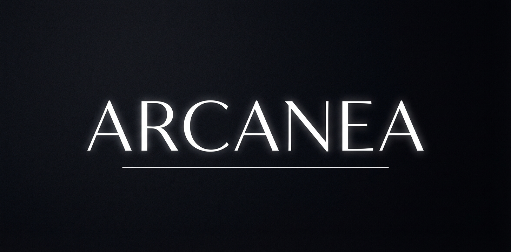
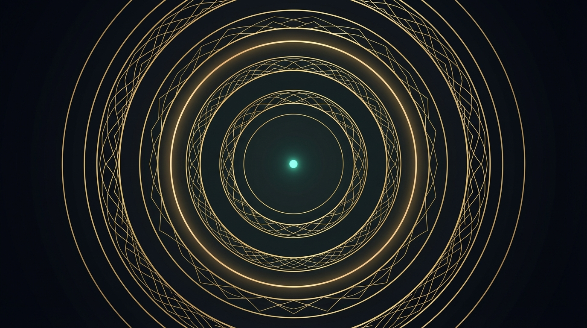
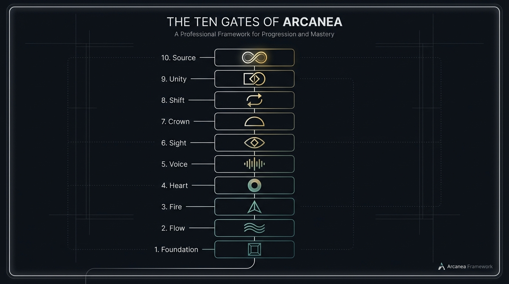

<div align="center">



# Sovereign Creative Operating System for Transmedia Universes

> *"Through the Gates we rise. With the Guardians we create."*

[](https://arcanea.ai)
[](https://github.com/frankxai/arcanea-ecosystem)
[](https://arcanea.ai)
[](https://github.com/frankxai/arcanea-claw)

[Explore arcanea.ai](https://arcanea.ai) · [Library of Mythos](book/README.md) · [World Repo Standard](https://github.com/frankxai/arcanea-ecosystem/blob/main/docs/WORLD_REPO_STANDARD.md) · [Community](https://arcanea.ai/community)

<br/>



</div>

---

## 1. Start with a World, Not a Prompt

Arcanea is a **Sovereign Creative Operating System** for authors, cinematic artists, game creators, and AI engineers.

Its foundational breakthrough is **Continuity Over Disconnected Prompts**. In legacy AI workflows, an author creates a character in ChatGPT, renders an inconsistent portrait in Midjourney, generates unrelated music in Suno, and loses all context between sessions.

In Arcanea, every creation is anchored to a version-controlled **World Repository** (`world.arcanea.json`). Characters retain exact facial and vocal embeddings. Places obey physical and metaphysical rules. Dialogue respects voice timbre and lore constraints defined in the **Locked Canon**.

```
┌─────────────────────────────────────────────────────────────────────────────┐
│ ✦ FROM EPHEMERAL PROMPTS TO COMPOUNDING SOVEREIGN UNIVERSES                 │
├─────────────────────────────────────────────────────────────────────────────┤
│ 1. GENESIS       │ Speak a universe into existence (`world.arcanea.json`)    │
│ 2. CONTINUITY    │ Multi-agent memory kernel guarantees zero lore drift     │
│ 3. TRANSMEDIA    │ Same lore compiles to Typst books, WebGPU nodes, & audio │
│ 4. PROVENANCE    │ Automated C2PA cryptographic provenance on all exports   │
│ 5. SOVEREIGNTY   │ Local NVMe disk storage via git — no cloud lock-in       │
└─────────────────────────────────────────────────────────────────────────────┘
```

---

## 2. The Seven Sovereign Creation Surfaces

Arcanea delivers a unified creator journey spanning command line, spatial canvas, and publication formats:

| Surface | Role & Technology | Experience |
|---|---|---|
| **1. Sovereign Gateway** | Single-command TUI & CLI (`arcanea`) | Sub-30ms Swiss typographic obsidian shell for instant dispatch. |
| **2. Author OS** | Rust-native Typst compilation engine | Compiles markdown manuscripts to publication-grade collector hardcovers. |
| **3. Arcanea Studio** | WebGPU Node DAG Canvas (`/flows`) | Modular synth aesthetic, spatial LOD, 200+ multi-modal models. |
| **4. Edge Model Router** | Hono on Cloudflare Workers (`api.arcanea.ai`) | Sub-4ms TTFB, Cloudflare AI Gateway provider failover, prompt caching. |
| **5. Arcanea Claw** | 24/7 Autonomous Media Daemon | Continuous background asset scoring (TASTE) and C2PA signing. |
| **6. Mobile & Desktop** | Tauri 2.0 shell + Next.js 15 PWA | 35MB RAM desktop shell with local NVMe directory mapping. |
| **7. Arcanea Bazaar** | Living Package Manager for worlds & skills | `arcanea install ...` for universe templates, agent skills, and skins. |

---

## 3. Cognitive Taxonomy: The Ten Gates

Arcanea structures creative mastery and agent cognitive architecture across the **Ten Gates**:

<div align="center">

</div>

* **Substrate & Foundation (Gate 1 · 396 Hz)**: Obsidian storage, file system boundaries, local NVMe security.
* **Flow & Velocity (Gate 2 · 417 Hz)**: Fast generative drafts, rapid iteration, and model failover.
* **Fire & Creation (Gate 3 · 528 Hz)**: Authoring scripts, character generation, and cinematic media.
* **Heart & Resonance (Gate 4 · 639 Hz)**: Emotional story architecture, thematic depth, and reader connection.
* **Voice & Rhetoric (Gate 5 · 741 Hz)**: Dialect consistency, acoustic voice synthesis, and dialogue constraints.
* **Vision & Strategy (Gate 6 · 852 Hz)**: Visual DNA, art direction, and world graph alignment.
* **Crown & Rigor (Gate 7 · 963 Hz)**: Executive review, Santa Method convergence, and canon verification.
* **Star & Cosmos (Gate 8 · 1074 Hz)**: Transmedia expansion, 3D USD worlds, and spatial computing.
* **Unity & Synthesis (Gate 9 · 1185 Hz)**: Multi-agent swarm consensus and global marketplace publishing.
* **Source & Sovereignty (Gate 10 · 1296 Hz)**: Immutable on-chain provenance and complete author ownership.

---

## 4. Local Development Quickstart

This repository is the public code mirror of `arcanea.ai`, built as a high-performance **pnpm / Turborepo monorepo**.

### Prerequisites
* **Node.js**: `v20.x` or `v22.x`
* **Package Manager**: `pnpm` (`v9.x+`)

### Clone and Launch

```bash
git clone https://github.com/frankxai/arcanea.git
cd arcanea
pnpm install
cp apps/web/.env.example apps/web/.env.local
pnpm dev:web
```

Open [http://localhost:3000](http://localhost:3000) to view the live portal.

### Code Quality Gates

Before submitting changes, all pull requests must pass strict quality checks:

```bash
pnpm turbo run type-check --filter=@arcanea/web
pnpm turbo run lint --filter=@arcanea/web
pnpm turbo run build --filter=@arcanea/web
```

---

## 5. Ecosystem Repositories

The Arcanea Omniverse is organized across specialized repositories within the [FrankX Ecosystem](https://github.com/frankxai):

* **[`arcanea-ecosystem`](https://github.com/frankxai/arcanea-ecosystem)**: Master portfolio registry, architecture specifications, PRD, and Red/Blue Team frameworks.
* **[`arcanea-studio`](https://github.com/frankxai/arcanea-studio)**: Infinite spatial node canvas for multi-modal generation and cinematic direction.
* **[`arcanea-orchestrator`](https://github.com/frankxai/arcanea-orchestrator)**: Edge model router (`api.arcanea.ai`) and multi-agent swarm runner.
* **[`arcanea-claw`](https://github.com/frankxai/arcanea-claw)**: Automated media daemon, visual taste scoring, and C2PA provenance engine.
* **[`arcanea-academy`](https://github.com/frankxai/arcanea-academy)**: World Proof Lab and creator progression portal.
* **[`arcanea-agent-skills`](https://github.com/frankxai/arcanea-agent-skills)**: Specialized agent skills for Claude Code, Codex, Antigravity, and Hermes.
* **[`arcanea-onchain`](https://github.com/frankxai/arcanea-onchain)**: Sovereign on-chain IP contracts, NFT Forge, and creator royalties.

---

## 6. Philosophy & Rights

> *"These books and tools are not entertainment. They are equipment for living and creating."*

Arcanea stands firmly for **Creator Sovereignty**. Your manuscripts, your lore, and your character definitions live locally on your machine in standard markdown and open schemas. AI is a partner in craft, not a landlord.

* **Contributing**: Read [CONTRIBUTING.md](CONTRIBUTING.md) to propose enhancements or world packages.
* **Terms & License**: See [LICENSE](LICENSE).

<div align="center">

*"Enter seeking, leave transformed, return whenever needed."*  
**Crafted with care by FrankX AI Systems**

</div>
