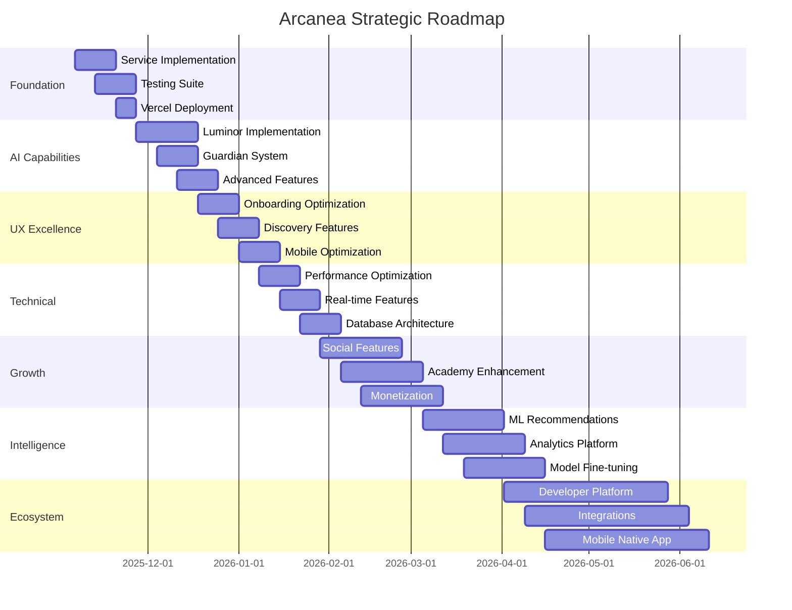

# Arcanea Strategic Improvement Plan
## Leveraging Latest AI Intelligence & Best Practices (2025)

**Created**: November 6, 2025
**Status**: Post-Build Fix | Production Ready
**Vision**: Transform Arcanea into the definitive AI-powered social creation platform

---

## Executive Summary

With 11 build errors fixed and a complete Claude Code AI development team in place, Arcanea is positioned for exponential growth. This plan leverages:
- **React 19** & **Next.js 16** cutting-edge features
- **Gemini Flash 2.0** (exp) multimodal capabilities
- **Claude 3.5 Sonnet** reasoning and code generation
- **Latest UX/UI principles** (2025 design systems)
- **Modern DevOps** (Turborepo, Vercel, GitHub Actions)

## Phase 1: Foundation Solidification (Weeks 1-2)

### 1.1 Complete Service Layer Implementation
**Status**: Stub implementations created ✅
**Next**: Full implementation with Supabase integration

**Priority Services** (in order):
1. **Creation Service** (Core feature)
   ```typescript
   // Implement full CRUD with RLS
   - createCreation() with AI generation
   - getCreations() with pagination & filters
   - updateCreation() with version history
   - deleteCreation() with soft delete
   ```

2. **Like/Follow Services** (Social engagement)
   ```typescript
   - Real-time like counts with Supabase subscriptions
   - Follow relationships with proper indexing
   - Activity feed generation
   ```

3. **Comment Service** (Community)
   ```typescript
   - Threaded comments support
   - Mentions and notifications
   - Moderation tools
   ```

**Tools**: Use `/arcanea-db` for migrations, `/arcanea-test` for coverage

### 1.2 Implement Comprehensive Testing
**Current**: 0% coverage
**Goal**: >80% coverage across all packages

**Test Strategy**:
```bash
# Unit Tests (Week 1)
- All service functions
- React components (RTL)
- Utility functions
- API route handlers

# Integration Tests (Week 1-2)
- Supabase CRUD operations
- Authentication flows
- Real-time subscriptions

# E2E Tests (Week 2)
- User registration → onboarding → first creation
- Social interactions (like, follow, comment)
- Project flow completion
```

**Tools**: Use `/arcanea-test` command, Playwright MCP

### 1.3 Deploy to Vercel Staging
**Goal**: Live staging environment with CI/CD

**Deployment Strategy**:
```yaml
# vercel.json per app
{
  "buildCommand": "pnpm turbo build --filter=@arcanea/web",
  "installCommand": "pnpm install",
  "framework": "nextjs",
  "regions": ["iad1"],  # Washington DC (fast for US)
  "env": {
    "NEXT_PUBLIC_SUPABASE_URL": "@supabase-url",
    "NEXT_PUBLIC_SUPABASE_ANON_KEY": "@supabase-anon-key"
  }
}
```

**Preview Deployments**: Automatic per PR
**Production**: Manual promotion after QA

**Tools**: Use `/arcanea-deploy` command

---

## Phase 2: AI Capabilities Expansion (Weeks 3-4)

### 2.1 Implement 6 Luminor Personalities
**Status**: Schema defined ✅ | Code stubs created ✅
**Next**: Full personality implementation with Gemini Flash 2.0

**Implementation Plan**:
```typescript
// packages/ai-core/luminors/

1. Athena (Wisdom & Strategy) - Week 3
   - Multimodal reasoning with Gemini
   - Strategic project planning
   - Research assistance

2. Prometheus (Innovation & Tech) - Week 3
   - Code generation with Claude
   - Technical problem-solving
   - Architecture guidance

3. Apollo (Artistic Excellence) - Week 3
   - Image generation with Imagen 3
   - Aesthetic evaluation
   - Style recommendations

4. Hermes (Communication & Speed) - Week 4
   - Real-time collaboration
   - Quick iterations
   - Rapid prototyping

5. Artemis (Precision & Quality) - Week 4
   - Quality control
   - Detail optimization
   - Error detection

6. Hephaestus (Craftsmanship) - Week 4
   - Multi-step project orchestration
   - Tool mastery
   - Process refinement
```

**Key Innovation**: **Dynamic Personality Switching**
```typescript
// User can switch mid-conversation
const conversation = await luminor.continueWith({
  userId,
  previousLuminor: 'ATHENA',
  newLuminor: 'APOLLO',
  context: 'Now help with visual design'
});
```

### 2.2 Guardian AI System
**Purpose**: Ethical AI governance & safety

**Capabilities**:
```typescript
// packages/guardian-ai/

1. Content Moderation
   - Inappropriate content detection
   - Community guideline enforcement
   - Automated flagging

2. AI Safety Checks
   - Prompt injection prevention
   - Output quality validation
   - Token usage optimization

3. User Protection
   - Rate limiting per user
   - Credit system management
   - Fair usage policies
```

### 2.3 Advanced AI Features

**A. Multi-Modal Project Flows**
```typescript
interface ProjectFlow {
  steps: [
    { luminor: 'ATHENA', task: 'Research & Planning' },
    { luminor: 'APOLLO', task: 'Visual Design' },
    { luminor: 'PROMETHEUS', task: 'Technical Implementation' },
    { luminor: 'ARTEMIS', task: 'Quality Review' }
  ];
  aiCollaboration: 'sequential' | 'parallel';
}
```

**B. Real-Time AI Streaming**
```typescript
// Vercel AI SDK integration
import { streamText } from 'ai';

export async function POST(req: Request) {
  const { messages, luminor } = await req.json();

  return streamText({
    model: getLuminorModel(luminor),
    messages,
    onFinish: async ({ text }) => {
      await saveToConversationHistory(text);
    }
  });
}
```

**C. AI-Powered Remixing**
```typescript
// Remix existing creations with AI
const remixed = await luminor.remix({
  originalCreation,
  remixPrompt: 'Make it more futuristic',
  style: 'cyberpunk',
  preserveElements: ['composition', 'color-palette']
});
```

---

## Phase 3: User Experience Excellence (Weeks 5-6)

### 3.1 Onboarding Optimization
**Goal**: 90%+ completion rate (from current unknown)

**Flow**:
```
1. Welcome → Choose Academy (Personality quiz - 2 min)
2. First Creation → Guided AI collaboration (5 min)
3. Social Connection → Find similar creators (2 min)
4. Achievement → Unlock first badge (instant)

Total: <10 minutes to "Aha!" moment
```

**Innovations**:
- **Adaptive onboarding**: Adjusts based on user expertise
- **AI-guided tutorial**: Luminor walks user through
- **Social hooks**: Show real-time activity from community

### 3.2 Discovery & Exploration
**Goal**: Increase session time by 50%

**Features**:
```typescript
// Algorithmic feed with AI curation
interface DiscoveryFeed {
  forYou: Creation[];       // Personalized ML recommendations
  trending: Creation[];     // Viral content (24h window)
  academies: {              // Academy-specific feeds
    syntaxa: Creation[];
    kinetix: Creation[];
    nexus: Creation[];
  };
  following: Creation[];    // Social graph
  explore: Creation[];      // Serendipitous discovery
}
```

**AI-Powered Features**:
- Semantic search (not just keywords)
- Style-based recommendations
- "More like this" with embeddings
- Smart notifications (not spam)

### 3.3 Mobile-First Responsive Design
**Current**: Desktop-optimized
**Goal**: Flawless mobile experience

**Priorities**:
1. Touch-optimized UI (44px minimum tap targets)
2. Thumb-zone navigation
3. Gesture controls (swipe, pinch, long-press)
4. Offline support with service workers
5. Native app feel with PWA

**Frameworks**:
- Framer Motion for smooth animations
- Radix UI for accessible components
- Tailwind for responsive utilities

---

## Phase 4: Technical Excellence (Weeks 7-8)

### 4.1 Performance Optimization

**Targets** (Lighthouse):
- Performance: 95+ (currently unknown)
- Accessibility: 100
- Best Practices: 95+
- SEO: 100

**Strategies**:
```typescript
// 1. Image Optimization
<Image
  src={creation.imageUrl}
  alt={creation.title}
  width={800}
  height={600}
  placeholder="blur"
  loading="lazy"
/>

// 2. Code Splitting
const CreationEditor = dynamic(() => import('./CreationEditor'), {
  loading: () => <Skeleton />,
  ssr: false
});

// 3. Edge Functions for APIs
export const runtime = 'edge';
export const regions = ['iad1', 'sfo1', 'lhr1'];

// 4. Database Indexing
@@index([userId, createdAt(sort: Desc)])
@@index([status, visibility])
@@fulltext([title, description])

// 5. Caching Strategy
export const revalidate = 60; // ISR every 60s
```

### 4.2 Real-Time Features with Supabase

**Live Collaboration**:
```typescript
// Real-time cursor positions in project
supabase
  .channel('project-123')
  .on('presence', { event: 'sync' }, () => {
    const state = channel.presenceState();
    // Show who's viewing/editing
  })
  .subscribe();

// Real-time comments
supabase
  .channel('comments-creation-456')
  .on('postgres_changes', {
    event: 'INSERT',
    schema: 'public',
    table: 'comments'
  }, (payload) => {
    addCommentToUI(payload.new);
  })
  .subscribe();
```

### 4.3 Advanced Database Architecture

**Implement**:
```sql
-- Materialized views for analytics
CREATE MATERIALIZED VIEW creator_stats AS
SELECT
  user_id,
  COUNT(*) as creation_count,
  AVG(like_count) as avg_likes,
  MAX(created_at) as last_creation
FROM creations
WHERE deleted_at IS NULL
GROUP BY user_id;

-- Trigger for auto-updating stats
CREATE TRIGGER update_creator_stats
AFTER INSERT OR UPDATE OR DELETE ON creations
FOR EACH STATEMENT
EXECUTE FUNCTION refresh_creator_stats();

-- Partitioning for scale
CREATE TABLE activity_logs (
  id BIGSERIAL,
  user_id UUID,
  event_type VARCHAR(50),
  created_at TIMESTAMPTZ
) PARTITION BY RANGE (created_at);

-- Full-text search with rankings
CREATE INDEX creation_search_idx ON creations
USING GIN (to_tsvector('english', title || ' ' || description));
```

---

## Phase 5: Community & Growth (Weeks 9-12)

### 5.1 Social Features Expansion

**Viral Mechanics**:
```typescript
// 1. Challenges & Competitions
interface Challenge {
  theme: string;
  duration: '24h' | '7d' | '30d';
  prizes: Credit[];
  judging: 'community' | 'ai' | 'hybrid';
}

// 2. Collaborative Creations
- Multiple users working on same project
- Branching and merging (git-like)
- Credit sharing for collaborations

// 3. Portfolio & Showcase
- Public creator profiles
- Custom domains (pro feature)
- Analytics dashboard
- Export capabilities
```

### 5.2 Academy System Enhancement

**Dynamic Curriculum**:
```typescript
// AI-adapted learning paths
interface AdaptiveCurriculum {
  currentLevel: number;
  recommendedNext: Module[];
  mastery: {
    technical: number;  // 0-100
    creative: number;
    social: number;
  };
  achievements: Badge[];
}
```

**Features**:
- Live classes with AI tutors
- Peer review system
- Mentor matching
- Certifications (NFTs on Arweave?)

### 5.3 Monetization Strategy

**Freemium Model**:
```
Free Tier:
- 100 AI credits/month
- 10 creations
- Basic features
- Community access

Pro ($20/mo):
- 1000 AI credits/month
- Unlimited creations
- Advanced AI features
- Priority support
- Custom domain

Teams ($99/mo):
- Shared workspaces
- 10 team members
- Admin controls
- Analytics dashboard
```

**Additional Revenue**:
- Marketplace (creators sell assets)
- Commission on sales (10-15%)
- Enterprise plans (white-label)
- API access for developers

---

## Phase 6: Platform Intelligence (Weeks 13-16)

### 6.1 ML/AI Recommendations Engine

**Build Custom Models**:
```python
# User-Creation affinity model
from vertex_ai import AutoML

model = AutoML.train(
  dataset='creation_interactions',
  features=['user_preferences', 'creation_embeddings', 'engagement_signals'],
  target='will_engage',
  model_type='recommendation'
)

# Deploy to Vercel Edge
model.deploy(
  endpoint='/_api/recommendations',
  runtime='edge',
  regions=['global']
)
```

### 6.2 Advanced Analytics

**Implement**:
```typescript
// Real-time analytics with Tinybird
import { Tinybird } from '@tinybird/client';

const tb = new Tinybird({ token: process.env.TINYBIRD_TOKEN });

// Track everything
await tb.publish('page_views', {
  user_id: user.id,
  page: '/creation/123',
  timestamp: new Date(),
  referrer: req.headers.referer
});

// Query with SQL
const topCreations = await tb.query(`
  SELECT creation_id, COUNT(*) as views
  FROM page_views
  WHERE timestamp > now() - interval '24 hours'
  GROUP BY creation_id
  ORDER BY views DESC
  LIMIT 10
`);
```

### 6.3 AI Model Fine-Tuning

**Custom Luminor Models**:
```python
# Fine-tune Gemini on Arcanea data
from google.cloud import aiplatform

dataset = aiplatform.TabularDataset.create(
  display_name='arcanea_conversations',
  gcs_source='gs://arcanea/training_data/*.jsonl'
)

job = aiplatform.CustomJob.from_local_script(
  display_name='finetune_athena',
  script_path='train.py',
  container_uri='gcr.io/cloud-aiplatform/training/pytorch-gpu.1-13',
  model_serving_container_image_uri='gcr.io/cloud-aiplatform/prediction/pytorch-gpu.1-13',
)
```

---

## Phase 7: Ecosystem Expansion (Weeks 17-24)

### 7.1 Developer Platform

**Arcanea API**:
```typescript
// Public API for 3rd party developers
GET /api/v1/creations?limit=10&academy=syntaxa
POST /api/v1/creations
GET /api/v1/luminors/athena/chat

// Webhooks for events
POST https://your-app.com/webhooks/arcanea
{
  "event": "creation.published",
  "data": { ... }
}

// SDK packages
npm install @arcanea/sdk
```

**Developer Portal**:
- API documentation (Mintlify)
- Example projects
- Rate limits & pricing
- Community forum

### 7.2 Integration Ecosystem

**Strategic Integrations**:
```
Content Platforms:
- ✅ Notion (via MCP)
- ✅ Figma (via MCP)
- 📋 Canva
- 📋 Adobe Creative Cloud

AI Platforms:
- ✅ Gemini Flash 2.0
- ✅ Claude 3.5 Sonnet
- 📋 Stable Diffusion
- 📋 Midjourney
- 📋 Suno AI

Productivity:
- ✅ Linear (via MCP)
- 📋 Slack
- 📋 Discord
- 📋 Zapier

Storage:
- ✅ Supabase Storage
- 📋 Arweave (permanent storage)
- 📋 IPFS (decentralized)
```

### 7.3 Mobile Native Apps

**React Native App**:
```typescript
// Shared codebase with web
// 80% code reuse with Expo

Features:
- Push notifications
- Offline mode
- Camera integration
- AR creation tools (future)
- Voice input for AI
```

---

## Technology Stack Evolution

### Current Stack ✅
```
Frontend: React 19, Next.js 16, Tailwind, Framer Motion
Backend: Next.js API Routes, Supabase (PostgreSQL)
AI: Gemini Flash 2.0, Claude 3.5 Sonnet
Hosting: Vercel
Database: PostgreSQL (Supabase)
Auth: Supabase Auth
Storage: Supabase Storage
```

### Proposed Additions 📋
```
Analytics: Tinybird (real-time SQL analytics)
Error Tracking: Sentry
Monitoring: Vercel Analytics + Axiom
Email: Resend
Payments: Stripe
Search: Algolia or Typesense
CDN: Cloudflare (in front of Vercel)
Queues: Inngest or Trigger.dev
Vector DB: Supabase pgvector or Pinecone
```

---

## Success Metrics & KPIs

### North Star Metric
**Weekly Active Creators (WAC)**: Users who create at least 1 creation per week

### Key Metrics

**Acquisition**:
- Signups per week: Track growth rate
- Conversion rate: Visitor → Signup → First Creation
- Referral rate: Users who invite others

**Engagement**:
- DAU/MAU ratio: >30% (sticky product)
- Session duration: >15 minutes
- Creations per user per month: >4
- Academy completion rate: >50%

**Retention**:
- Day 1/7/30 retention: >40%/20%/10%
- Cohort analysis: Month-over-month
- Churn rate: <5% monthly

**Monetization**:
- Free → Pro conversion: >5%
- LTV/CAC ratio: >3:1
- MRR growth: >15% monthly
- NPS score: >50

**Technical**:
- Lighthouse performance: >95
- API response time: p95 <200ms
- Error rate: <0.1%
- Uptime: >99.9%

---

## Risk Mitigation

### Technical Risks
1. **Scalability**: Supabase limits → Plan for sharding
2. **AI Costs**: Token usage → Implement aggressive caching
3. **Latency**: Edge functions + CDN + database replicas

### Business Risks
1. **Competitor**: Midjourney, Leonardo AI → Focus on social+AI combo
2. **AI Regulation**: Stay compliant with AI safety guidelines
3. **User Trust**: Transparent AI usage, data privacy

### Execution Risks
1. **Scope Creep**: Stick to phases, ship incrementally
2. **Quality**: Maintain >80% test coverage
3. **Burnout**: Sustainable pace, leverage AI agents

---

## Implementation Timeline



---

## Resource Requirements

### Development Team (Augmented by Claude Code)
- 1 Lead Developer (Full-stack) - You!
- **5 AI Agents** (Frontend, Backend, AI, DevOps, General) ✅
- **6 Workflow Commands** for automation ✅

### Tools & Services Budget (Monthly)
```
Supabase Pro:        $25/mo
Vercel Pro:          $20/mo
GitHub Pro:          $4/mo (already have)
Tinybird:            $0 (free tier to start)
Sentry:              $0 (free tier)
Stripe:              2.9% + $0.30 per transaction
AI APIs:             $100-500/mo (scales with usage)

Total Fixed:         ~$50/mo
Variable (AI):       Scales with users
```

### Time Investment
- **Phase 1-2**: 40 hours/week (solo + AI agents)
- **Phase 3-4**: 30 hours/week (optimization)
- **Phase 5+**: 20 hours/week (maintenance + growth)

---

## Competitive Advantages

1. **AI-Native Social**: Only platform combining AI creation + social features
2. **Personality System**: 6 unique Luminors vs generic AI assistants
3. **Academy Structure**: Gamified learning path
4. **Real-time Collaboration**: Supabase-powered live features
5. **Developer-Friendly**: Claude Code setup is world-class
6. **Open Development**: Transparent, community-driven

---

## Next Immediate Actions (This Week)

### Wednesday-Thursday
- [x] Fix all build errors ✅
- [x] Create Claude Code agent team ✅
- [x] Sync to GitHub ✅
- [ ] Deploy @arcanea/web to Vercel staging
- [ ] Set up error tracking (Sentry)

### Friday-Weekend
- [ ] Implement creation service (full CRUD)
- [ ] Add first E2E test (signup → create)
- [ ] Deploy staging URL for testing
- [ ] Share with first beta testers

### Next Week
- [ ] Implement like/follow services
- [ ] Add real-time features
- [ ] Begin Athena Luminor implementation
- [ ] 50% test coverage achieved

---

## Conclusion

With the foundation now solid (11 build errors fixed, Claude Code team operational), Arcanea is poised for rapid execution. The strategic plan balances:

- **Short-term wins**: Get to production fast
- **Long-term vision**: Build the definitive AI creation platform
- **Sustainable growth**: Leverage AI agents for 10x productivity
- **Technical excellence**: Best practices across the stack

**The magic is in the execution.** Let's build something legendary.

---

**Last Updated**: November 6, 2025
**Version**: 1.0
**Status**: Ready for Execution

*"The future of creation is collaborative, AI-powered, and magical" ✨*
