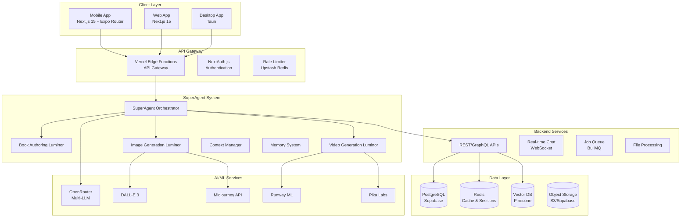

# Arcanea Mobile App - Technical Architecture Specification

> **Version**: 1.0  
> **Author**: Chief Technical Architect  
> **Date**: September 8, 2025  
> **Target**: Google Play Store deployment by end of week

## Executive Summary

This document outlines the comprehensive technical architecture for the Arcanea mobile application, designed for rapid deployment to Google Play Store while maintaining enterprise-grade scalability, security, and performance. The architecture leverages Next.js 15 with Expo Router for hybrid mobile-web deployment, integrated with a sophisticated SuperAgent AI system and three specialized Luminor agents.

## 1. System Architecture Overview

### 1.1 High-Level Architecture



### 1.2 Core Technology Stack

| Layer | Technology | Purpose | Justification |
|-------|------------|---------|---------------|
| **Mobile Framework** | Next.js 15 + Expo Router | Hybrid mobile-web app | Single codebase, rapid deployment |
| **Runtime** | React Native 0.74 | Native mobile performance | Platform-specific optimizations |
| **State Management** | Zustand + TanStack Query | Client & server state | Lightweight, performant |
| **UI Framework** | NativeWind + Tailwind CSS | Consistent styling | Design system compatibility |
| **Authentication** | NextAuth.js + Supabase Auth | Secure auth flow | Industry standard |
| **Database** | PostgreSQL (Supabase) | Primary data store | ACID compliance, scaling |
| **Caching** | Redis (Upstash) | Performance optimization | Sub-millisecond responses |
| **Vector Storage** | Pinecone | AI embeddings | Semantic search capabilities |
| **API Layer** | Vercel Edge Functions | Serverless APIs | Global edge distribution |
| **AI Integration** | OpenRouter Multi-LLM | AI orchestration | Cost optimization, fallbacks |

### 1.3 Mobile-First Architecture Principles

1. **Offline-First Design**: Core functionality works without internet
2. **Progressive Enhancement**: Features degrade gracefully on slower connections
3. **Native Performance**: 60fps animations, instant transitions
4. **Battery Optimization**: Efficient resource usage, background task management
5. **Adaptive UI**: Responsive design across device sizes and orientations

## 2. SuperAgent Architecture

### 2.1 SuperAgent Orchestrator

```typescript
// packages/superagent/orchestrator.ts
export class SuperAgentOrchestrator {
  private luminors: Map<LuminorType, BaseLuminor>;
  private contextManager: ContextManager;
  private memorySystem: MemorySystem;
  private toolRegistry: ToolRegistry;

  constructor() {
    this.luminors = new Map([
      ['book-authoring', new BookAuthoringLuminor()],
      ['image-generation', new ImageGenerationLuminor()],
      ['video-generation', new VideoGenerationLuminor()],
    ]);
    this.contextManager = new ContextManager();
    this.memorySystem = new MemorySystem();
    this.toolRegistry = new ToolRegistry();
  }

  async processRequest(request: UserRequest): Promise<AgentResponse> {
    // 1. Analyze request intent
    const intent = await this.analyzeIntent(request);
    
    // 2. Select appropriate Luminor
    const luminor = this.selectLuminor(intent);
    
    // 3. Gather context
    const context = await this.contextManager.buildContext(request.userId, intent);
    
    // 4. Execute with fallback chain
    return await this.executeWithFallbacks(luminor, context, request);
  }

  private async executeWithFallbacks(
    luminor: BaseLuminor, 
    context: Context, 
    request: UserRequest
  ): Promise<AgentResponse> {
    const fallbackChain = this.buildFallbackChain(luminor);
    
    for (const agent of fallbackChain) {
      try {
        const response = await agent.execute(context, request);
        if (this.validateResponse(response)) {
          await this.memorySystem.store(request.userId, context, response);
          return response;
        }
      } catch (error) {
        console.warn(`Agent ${agent.name} failed:`, error);
        continue;
      }
    }
    
    throw new Error('All agents failed');
  }
}
```

### 2.2 Context Management System

```typescript
// packages/superagent/context-manager.ts
export class ContextManager {
  private redis: Redis;
  private vectorDB: Pinecone;

  async buildContext(userId: string, intent: Intent): Promise<Context> {
    const [userProfile, conversationHistory, relevantMemories] = await Promise.all([
      this.getUserProfile(userId),
      this.getConversationHistory(userId, 10), // Last 10 exchanges
      this.getRelevantMemories(userId, intent.query, 5)
    ]);

    return {
      user: userProfile,
      conversation: conversationHistory,
      memories: relevantMemories,
      intent,
      timestamp: new Date(),
      sessionId: this.generateSessionId(),
    };
  }

  private async getRelevantMemories(
    userId: string, 
    query: string, 
    limit: number
  ): Promise<Memory[]> {
    const embedding = await this.generateEmbedding(query);
    
    const results = await this.vectorDB.query({
      vector: embedding,
      filter: { userId },
      topK: limit,
      includeMetadata: true,
    });

    return results.matches.map(match => ({
      content: match.metadata.content,
      timestamp: match.metadata.timestamp,
      relevanceScore: match.score,
    }));
  }
}
```

### 2.3 Tool Calling Framework

```typescript
// packages/superagent/tools/registry.ts
export class ToolRegistry {
  private tools: Map<string, Tool>;

  constructor() {
    this.registerDefaultTools();
  }

  private registerDefaultTools() {
    // Document processing tools
    this.register(new PDFExtractorTool());
    this.register(new DOCXConverterTool());
    this.register(new MarkdownGeneratorTool());
    
    // Image generation tools
    this.register(new DALLETool());
    this.register(new MidjourneyTool());
    this.register(new StyleTransferTool());
    
    // Video generation tools
    this.register(new RunwayTool());
    this.register(new PikaTool());
    this.register(new VideoEditingTool());
    
    // Utility tools
    this.register(new WebSearchTool());
    this.register(new CodeExecutorTool());
    this.register(new FileManagerTool());
  }

  async executeTool(toolName: string, parameters: ToolParameters): Promise<ToolResult> {
    const tool = this.tools.get(toolName);
    if (!tool) {
      throw new Error(`Tool ${toolName} not found`);
    }

    // Rate limiting check
    await this.checkRateLimit(tool, parameters.userId);
    
    // Execute with timeout
    const result = await Promise.race([
      tool.execute(parameters),
      this.timeoutPromise(tool.timeout || 30000)
    ]);

    // Log usage for cost tracking
    await this.logUsage(tool, parameters, result);
    
    return result;
  }
}
```

### 2.4 Rate Limiting & Cost Optimization

```typescript
// packages/superagent/rate-limiter.ts
export class IntelligentRateLimiter {
  private redis: Redis;
  private costTracker: CostTracker;

  constructor() {
    this.redis = new Redis(process.env.REDIS_URL);
    this.costTracker = new CostTracker();
  }

  async checkLimit(userId: string, toolName: string): Promise<boolean> {
    const userTier = await this.getUserTier(userId);
    const limits = this.getLimitsForTier(userTier);
    
    const usage = await this.getCurrentUsage(userId, toolName);
    
    if (usage >= limits[toolName]) {
      // Check if user can upgrade or purchase credits
      return await this.handleLimitExceeded(userId, toolName);
    }

    return true;
  }

  async optimizeCosts(request: UserRequest): Promise<ModelSelection> {
    const complexity = await this.analyzeComplexity(request);
    
    // Route to most cost-effective model for the task
    if (complexity.score < 0.3) {
      return { provider: 'openai', model: 'gpt-3.5-turbo' };
    } else if (complexity.score < 0.7) {
      return { provider: 'anthropic', model: 'claude-3-sonnet' };
    } else {
      return { provider: 'anthropic', model: 'claude-3-opus' };
    }
  }
}
```

### 2.5 Error Handling & Fallback Mechanisms

```typescript
// packages/superagent/fallback-handler.ts
export class FallbackHandler {
  private fallbackStrategies: Map<string, FallbackStrategy[]>;

  constructor() {
    this.fallbackStrategies = new Map([
      ['text-generation', [
        { provider: 'openai', model: 'gpt-4-turbo' },
        { provider: 'anthropic', model: 'claude-3-opus' },
        { provider: 'google', model: 'gemini-pro' },
        { provider: 'local', model: 'cached-response' },
      ]],
      ['image-generation', [
        { provider: 'openai', model: 'dall-e-3' },
        { provider: 'stability', model: 'sdxl' },
        { provider: 'midjourney', model: 'v6' },
        { provider: 'local', model: 'template-image' },
      ]],
      ['video-generation', [
        { provider: 'runway', model: 'gen-2' },
        { provider: 'pika', model: 'v1' },
        { provider: 'local', model: 'gif-conversion' },
      ]],
    ]);
  }

  async handleFailure(
    originalError: Error, 
    taskType: string, 
    context: Context
  ): Promise<AgentResponse> {
    const strategies = this.fallbackStrategies.get(taskType) || [];
    
    for (const strategy of strategies) {
      try {
        const result = await this.executeStrategy(strategy, context);
        
        // Log successful fallback
        await this.logFallbackSuccess(originalError, strategy, result);
        
        return result;
      } catch (fallbackError) {
        console.warn(`Fallback strategy ${strategy.provider} failed:`, fallbackError);
      }
    }
    
    // All fallbacks failed, return graceful degradation
    return this.createGracefulResponse(originalError, taskType);
  }
}
```

## 3. Specialized Luminors Implementation

### 3.1 Book Authoring Luminor

```typescript
// packages/luminors/book-authoring/index.ts
export class BookAuthoringLuminor extends BaseLuminor {
  name = 'Scripta';
  description = 'Master of narrative and written expression';
  color = '#8B5CF6';
  expertise = [
    'narrative-structure',
    'character-development',
    'plot-progression',
    'writing-techniques',
    'publishing-formats'
  ];

  async generateBookOutline(request: BookOutlineRequest): Promise<BookOutline> {
    const context = await this.buildWritingContext(request);
    
    const prompt = `
    You are Scripta, the master storyteller of Arcanea. Create a comprehensive book outline for:
    
    Title: ${request.title}
    Genre: ${request.genre}
    Target Length: ${request.targetWordCount} words
    Target Audience: ${request.audience}
    
    Key themes: ${request.themes?.join(', ')}
    
    Provide:
    1. Three-act structure breakdown
    2. Chapter summaries with word count targets
    3. Character development arcs
    4. Plot points and turning moments
    5. Research requirements
    6. Writing milestones and deadlines
    `;

    const outline = await this.generateWithTools(prompt, [
      'research-assistant',
      'narrative-analyzer',
      'character-generator'
    ]);

    return this.structureBookOutline(outline);
  }

  async assistWithWriting(chapter: ChapterDraft): Promise<WritingAssistance> {
    const analysis = await this.analyzeWriting(chapter);
    
    return {
      suggestions: analysis.improvements,
      styleEnhancements: analysis.styleImprovements,
      structuralChanges: analysis.structuralSuggestions,
      characterConsistency: analysis.characterChecks,
      continuityNotes: analysis.continuityIssues,
    };
  }

  async exportToFormats(manuscript: Manuscript): Promise<ExportResults> {
    const formats = ['epub', 'pdf', 'docx', 'kindle', 'print-ready'];
    
    const exportPromises = formats.map(format => 
      this.exportToFormat(manuscript, format)
    );

    const results = await Promise.allSettled(exportPromises);
    
    return results.reduce((acc, result, index) => {
      const format = formats[index];
      if (result.status === 'fulfilled') {
        acc.successful[format] = result.value;
      } else {
        acc.failed[format] = result.reason;
      }
      return acc;
    }, { successful: {}, failed: {} });
  }

  private async exportToFormat(manuscript: Manuscript, format: string): Promise<ExportedFile> {
    switch (format) {
      case 'epub':
        return await this.generateEPUB(manuscript);
      case 'pdf':
        return await this.generatePDF(manuscript);
      case 'kindle':
        return await this.generateKindleFormat(manuscript);
      case 'print-ready':
        return await this.generatePrintReady(manuscript);
      default:
        throw new Error(`Unsupported format: ${format}`);
    }
  }
}
```

### 3.2 Image Generation Luminor

```typescript
// packages/luminors/image-generation/index.ts
export class ImageGenerationLuminor extends BaseLuminor {
  name = 'Lumina';
  description = 'Visionary of light and digital artistry';
  color = '#F59E0B';
  expertise = [
    'digital-art',
    'style-transfer',
    'image-synthesis',
    'visual-storytelling',
    'brand-design'
  ];

  async generateImage(request: ImageGenerationRequest): Promise<GeneratedImage> {
    // Analyze request complexity and choose optimal provider
    const provider = await this.selectProvider(request);
    
    const enhancedPrompt = await this.enhancePrompt(request.prompt, request.style);
    
    try {
      const result = await this.executeGeneration(provider, {
        prompt: enhancedPrompt,
        style: request.style,
        aspectRatio: request.aspectRatio,
        quality: request.quality || 'standard',
        seed: request.seed,
      });

      // Post-process if requested
      if (request.postProcessing) {
        result.processedImage = await this.applyPostProcessing(
          result.image,
          request.postProcessing
        );
      }

      return result;
    } catch (error) {
      // Fallback to alternative provider
      return await this.handleGenerationFailure(error, request);
    }
  }

  async createStyleTransfer(
    sourceImage: ImageBuffer,
    styleReference: string | ImageBuffer
  ): Promise<StyledImage> {
    const styleAnalysis = await this.analyzeStyle(styleReference);
    
    const transferRequest = {
      source: sourceImage,
      style: styleAnalysis,
      strength: 0.8, // Configurable
      preserveColors: false,
    };

    return await this.executeStyleTransfer(transferRequest);
  }

  async generateImageSeries(request: SeriesGenerationRequest): Promise<ImageSeries> {
    const { theme, count, consistency } = request;
    
    // Generate base style parameters for consistency
    const baseStyle = await this.establishBaseStyle(theme);
    const seed = this.generateConsistentSeed();

    const generations = await Promise.allSettled(
      Array.from({ length: count }, (_, index) => 
        this.generateConsistentImage({
          ...request,
          baseStyle,
          seed: seed + index,
          variationIndex: index,
        })
      )
    );

    return this.compileImageSeries(generations);
  }

  async editImage(image: ImageBuffer, instructions: EditInstructions): Promise<EditedImage> {
    const editType = this.classifyEditType(instructions);
    
    switch (editType) {
      case 'inpainting':
        return await this.performInpainting(image, instructions);
      case 'outpainting':
        return await this.performOutpainting(image, instructions);
      case 'object-replacement':
        return await this.replaceObject(image, instructions);
      case 'background-removal':
        return await this.removeBackground(image);
      case 'enhancement':
        return await this.enhanceImage(image, instructions);
      default:
        throw new Error(`Unsupported edit type: ${editType}`);
    }
  }

  private async selectProvider(request: ImageGenerationRequest): Promise<ImageProvider> {
    const complexity = this.analyzeComplexity(request);
    
    if (request.style?.includes('photorealistic')) {
      return { name: 'dall-e-3', priority: 1 };
    } else if (request.style?.includes('artistic') || request.style?.includes('stylized')) {
      return { name: 'midjourney', priority: 1 };
    } else if (complexity < 0.5) {
      return { name: 'stable-diffusion-xl', priority: 1 };
    } else {
      return { name: 'dall-e-3', priority: 1 };
    }
  }
}
```

### 3.3 Video Generation Luminor

```typescript
// packages/luminors/video-generation/index.ts
export class VideoGenerationLuminor extends BaseLuminor {
  name = 'Kinetix';
  description = 'Master of motion and temporal artistry';
  color = '#EF4444';
  expertise = [
    'motion-generation',
    'video-synthesis',
    'temporal-consistency',
    'story-boarding',
    'video-editing'
  ];

  async generateVideo(request: VideoGenerationRequest): Promise<GeneratedVideo> {
    // Validate request parameters
    this.validateVideoRequest(request);
    
    // Select optimal provider based on requirements
    const provider = await this.selectVideoProvider(request);
    
    try {
      // For text-to-video generation
      if (request.type === 'text-to-video') {
        return await this.generateFromText(request, provider);
      }
      
      // For image-to-video generation
      if (request.type === 'image-to-video') {
        return await this.generateFromImage(request, provider);
      }
      
      // For video-to-video (style transfer, enhancement)
      if (request.type === 'video-to-video') {
        return await this.transformVideo(request, provider);
      }
      
    } catch (error) {
      return await this.handleVideoGenerationFailure(error, request);
    }
  }

  async createVideoFromScript(script: VideoScript): Promise<VideoProduction> {
    // 1. Analyze script and create storyboard
    const storyboard = await this.generateStoryboard(script);
    
    // 2. Generate individual scenes
    const scenes = await this.generateScenes(storyboard);
    
    // 3. Create transitions and effects
    const transitions = await this.createTransitions(scenes, script.style);
    
    // 4. Compile final video
    const finalVideo = await this.compileVideo({
      scenes,
      transitions,
      audio: script.audioInstructions,
      style: script.style,
    });

    return {
      video: finalVideo,
      storyboard,
      scenes,
      metadata: this.generateMetadata(script, finalVideo),
    };
  }

  async enhanceVideo(
    sourceVideo: VideoBuffer,
    enhancements: VideoEnhancements
  ): Promise<EnhancedVideo> {
    const tasks = [];

    if (enhancements.upscale) {
      tasks.push(this.upscaleVideo(sourceVideo, enhancements.upscale));
    }

    if (enhancements.framerate) {
      tasks.push(this.interpolateFrames(sourceVideo, enhancements.framerate));
    }

    if (enhancements.stabilization) {
      tasks.push(this.stabilizeVideo(sourceVideo));
    }

    if (enhancements.colorCorrection) {
      tasks.push(this.correctColors(sourceVideo, enhancements.colorCorrection));
    }

    if (enhancements.audioEnhancement) {
      tasks.push(this.enhanceAudio(sourceVideo, enhancements.audioEnhancement));
    }

    // Execute enhancements in parallel where possible
    const results = await this.executeEnhancementPipeline(tasks);
    
    return this.combineEnhancements(sourceVideo, results);
  }

  async editVideo(video: VideoBuffer, instructions: VideoEditInstructions): Promise<EditedVideo> {
    const editPlan = await this.createEditPlan(instructions);
    
    const editOperations = editPlan.operations.map(operation => {
      switch (operation.type) {
        case 'cut':
          return this.cutVideo(video, operation.parameters);
        case 'merge':
          return this.mergeSegments(video, operation.parameters);
        case 'add-effects':
          return this.addEffects(video, operation.parameters);
        case 'add-text':
          return this.addTextOverlay(video, operation.parameters);
        case 'add-music':
          return this.addBackgroundMusic(video, operation.parameters);
        case 'color-grading':
          return this.applyColorGrading(video, operation.parameters);
        default:
          throw new Error(`Unknown edit operation: ${operation.type}`);
      }
    });

    // Execute edit operations in sequence
    let currentVideo = video;
    for (const operation of editOperations) {
      currentVideo = await operation;
    }

    return {
      video: currentVideo,
      editHistory: editPlan.operations,
      metadata: await this.generateEditMetadata(video, currentVideo),
    };
  }

  private async selectVideoProvider(request: VideoGenerationRequest): Promise<VideoProvider> {
    const duration = request.duration || 5; // seconds
    const quality = request.quality || 'standard';
    
    if (duration <= 4 && quality === 'high') {
      return { name: 'runway-gen2', priority: 1 };
    } else if (duration <= 3 && request.style?.includes('anime')) {
      return { name: 'pika-labs', priority: 1 };
    } else if (request.type === 'image-to-video') {
      return { name: 'stable-video-diffusion', priority: 1 };
    } else {
      return { name: 'runway-gen2', priority: 1 };
    }
  }
}
```

## 4. Mobile Deployment Strategy

### 4.1 Next.js 15 + Expo Router Setup

```typescript
// app.config.ts - Expo configuration
import { ExpoConfig } from 'expo/config';

const config: ExpoConfig = {
  name: 'Arcanea',
  slug: 'arcanea',
  version: '1.0.0',
  orientation: 'portrait',
  icon: './assets/icon.png',
  userInterfaceStyle: 'automatic',
  splash: {
    image: './assets/splash.png',
    resizeMode: 'contain',
    backgroundColor: '#000000'
  },
  assetBundlePatterns: ['**/*'],
  ios: {
    supportsTablet: true,
    bundleIdentifier: 'com.arcanea.app',
    config: {
      usesNonExemptEncryption: false,
    },
  },
  android: {
    package: 'com.arcanea.app',
    versionCode: 1,
    compileSdkVersion: 34,
    targetSdkVersion: 34,
    permissions: [
      'android.permission.CAMERA',
      'android.permission.RECORD_AUDIO',
      'android.permission.READ_EXTERNAL_STORAGE',
      'android.permission.WRITE_EXTERNAL_STORAGE',
    ],
    adaptiveIcon: {
      foregroundImage: './assets/adaptive-icon.png',
      backgroundColor: '#FFFFFF'
    }
  },
  web: {
    favicon: './assets/favicon.png',
    bundler: 'metro',
  },
  plugins: [
    'expo-router',
    'expo-font',
    'expo-notifications',
    ['expo-camera', { cameraPermission: 'Allow Arcanea to access camera for content creation' }],
    ['expo-media-library', { photosPermission: 'Allow Arcanea to access photos', savePhotosPermission: 'Allow Arcanea to save photos' }],
  ],
  experiments: {
    typedRoutes: true,
  },
  extra: {
    router: {
      origin: false,
    },
    eas: {
      projectId: 'arcanea-mobile-project-id',
    },
  },
};

export default config;
```

### 4.2 EAS Build Configuration

```yaml
# eas.json
{
  "cli": {
    "version": ">= 5.0.0"
  },
  "build": {
    "development": {
      "developmentClient": true,
      "distribution": "internal",
      "android": {
        "gradleCommand": ":app:assembleDebug"
      },
      "ios": {
        "buildConfiguration": "Debug"
      }
    },
    "preview": {
      "distribution": "internal",
      "android": {
        "buildType": "apk"
      }
    },
    "production": {
      "android": {
        "buildType": "app-bundle"
      },
      "ios": {
        "buildConfiguration": "Release"
      }
    }
  },
  "submit": {
    "production": {
      "android": {
        "serviceAccountKeyPath": "./google-play-service-account.json",
        "track": "production"
      },
      "ios": {
        "appleId": "your-apple-id",
        "ascAppId": "your-app-store-connect-app-id",
        "appleTeamId": "your-team-id"
      }
    }
  }
}
```

### 4.3 Code Signing & Certificate Management

```bash
#!/bin/bash
# scripts/setup-certificates.sh

# Android - Generate signing key
keytool -genkeypair -v -storetype PKCS12 -keystore arcanea-release-key.keystore \
  -alias arcanea-key-alias \
  -keyalg RSA \
  -keysize 2048 \
  -validity 10000

# Upload keystore to EAS
eas credentials:configure:android

# iOS - Manage certificates through EAS
eas credentials:configure:ios
```

### 4.4 OTA Updates Configuration

```typescript
// app/_layout.tsx - OTA Updates Setup
import { useEffect } from 'react';
import * as Updates from 'expo-updates';

export default function RootLayout() {
  useEffect(() => {
    async function checkForUpdates() {
      try {
        const update = await Updates.checkForUpdateAsync();
        if (update.isAvailable) {
          await Updates.fetchUpdateAsync();
          // Show user-friendly update prompt
          await showUpdatePrompt();
        }
      } catch (error) {
        console.log('Error checking for updates:', error);
      }
    }

    checkForUpdates();
  }, []);

  const showUpdatePrompt = async () => {
    // Custom update UI component
    const shouldUpdate = await showUpdateDialog();
    if (shouldUpdate) {
      await Updates.reloadAsync();
    }
  };

  return (
    // App layout
  );
}

// components/UpdateDialog.tsx
export function UpdateDialog({ onUpdate, onLater }) {
  return (
    <Modal>
      <View className="bg-black/90 p-6 rounded-xl mx-4">
        <Text className="text-white text-xl font-bold mb-4">
          New Features Available!
        </Text>
        <Text className="text-gray-300 mb-6">
          Update Arcanea to access the latest AI capabilities and improvements.
        </Text>
        <View className="flex-row justify-end space-x-4">
          <Button variant="ghost" onPress={onLater}>
            Later
          </Button>
          <Button onPress={onUpdate}>
            Update Now
          </Button>
        </View>
      </View>
    </Modal>
  );
}
```

### 4.5 Performance Monitoring

```typescript
// lib/monitoring.ts
import * as Sentry from '@sentry/react-native';
import { Analytics } from '@segment/analytics-react-native';

// Sentry configuration
Sentry.init({
  dsn: process.env.EXPO_PUBLIC_SENTRY_DSN,
  enableTracing: true,
  integrations: [
    new Sentry.ReactNativeTracing({
      enableUserInteractionTracing: true,
      enableNativeFramesTracking: true,
    }),
  ],
  tracesSampleRate: 0.1,
});

// Analytics setup
export const analytics = new Analytics({
  writeKey: process.env.EXPO_PUBLIC_SEGMENT_WRITE_KEY!,
  trackAppLifecycleEvents: true,
  trackDeepLinks: true,
});

// Performance monitoring utilities
export class PerformanceMonitor {
  static startTransaction(name: string) {
    return Sentry.startTransaction({ name });
  }

  static trackScreenLoad(screenName: string) {
    const transaction = this.startTransaction(`Screen: ${screenName}`);
    return {
      finish: () => transaction.finish(),
    };
  }

  static trackAIInteraction(luminor: string, operation: string) {
    analytics.track('AI Interaction', {
      luminor,
      operation,
      timestamp: new Date().toISOString(),
    });
  }

  static trackError(error: Error, context?: any) {
    Sentry.captureException(error, {
      extra: context,
    });
  }
}
```

### 4.6 Security Implementation

```typescript
// lib/security.ts
import * as SecureStore from 'expo-secure-store';
import * as Crypto from 'expo-crypto';
import { Platform } from 'react-native';

export class SecurityManager {
  private static readonly KEY_PREFIX = 'arcanea_';

  // Secure token storage
  static async storeSecurely(key: string, value: string): Promise<void> {
    const secureKey = this.KEY_PREFIX + key;
    
    if (Platform.OS === 'web') {
      // Fallback to encrypted localStorage for web
      const encrypted = await this.encrypt(value);
      localStorage.setItem(secureKey, encrypted);
    } else {
      await SecureStore.setItemAsync(secureKey, value, {
        keychainService: 'Arcanea',
        requireAuthentication: true,
      });
    }
  }

  static async retrieveSecurely(key: string): Promise<string | null> {
    const secureKey = this.KEY_PREFIX + key;
    
    if (Platform.OS === 'web') {
      const encrypted = localStorage.getItem(secureKey);
      return encrypted ? await this.decrypt(encrypted) : null;
    } else {
      return await SecureStore.getItemAsync(secureKey, {
        requireAuthentication: true,
      });
    }
  }

  // API request signing
  static async signRequest(
    method: string,
    url: string,
    body?: any
  ): Promise<string> {
    const timestamp = Date.now().toString();
    const payload = JSON.stringify({ method, url, body, timestamp });
    
    const signature = await Crypto.digestStringAsync(
      Crypto.CryptoDigestAlgorithm.SHA256,
      payload + process.env.EXPO_PUBLIC_API_SECRET,
      { encoding: Crypto.CryptoEncoding.HEX }
    );

    return signature;
  }

  // Biometric authentication
  static async authenticateWithBiometrics(): Promise<boolean> {
    try {
      const result = await LocalAuthentication.authenticateAsync({
        promptMessage: 'Authenticate to access Arcanea',
        fallbackLabel: 'Use Passcode',
      });
      
      return result.success;
    } catch (error) {
      console.error('Biometric authentication failed:', error);
      return false;
    }
  }

  private static async encrypt(text: string): Promise<string> {
    // Implement encryption for web fallback
    const key = await this.getEncryptionKey();
    // Use Web Crypto API for encryption
    return text; // Simplified for brevity
  }

  private static async decrypt(encryptedText: string): Promise<string> {
    // Implement decryption for web fallback
    const key = await this.getEncryptionKey();
    // Use Web Crypto API for decryption
    return encryptedText; // Simplified for brevity
  }
}
```

## 5. Backend Services Architecture

### 5.1 Supabase Integration

```typescript
// lib/supabase/client.ts
import { createClient } from '@supabase/supabase-js';
import type { Database } from './database.types';

const supabaseUrl = process.env.EXPO_PUBLIC_SUPABASE_URL!;
const supabaseAnonKey = process.env.EXPO_PUBLIC_SUPABASE_ANON_KEY!;

export const supabase = createClient<Database>(supabaseUrl, supabaseAnonKey, {
  auth: {
    storage: AsyncStorage,
    autoRefreshToken: true,
    persistSession: true,
    detectSessionInUrl: false,
  },
});

// Database schema types
export interface Database {
  public: {
    Tables: {
      users: {
        Row: {
          id: string;
          email: string;
          full_name: string | null;
          avatar_url: string | null;
          subscription_tier: 'free' | 'pro' | 'enterprise';
          created_at: string;
          updated_at: string;
        };
        Insert: {
          id?: string;
          email: string;
          full_name?: string | null;
          avatar_url?: string | null;
          subscription_tier?: 'free' | 'pro' | 'enterprise';
        };
        Update: {
          full_name?: string | null;
          avatar_url?: string | null;
          subscription_tier?: 'free' | 'pro' | 'enterprise';
        };
      };
      projects: {
        Row: {
          id: string;
          user_id: string;
          title: string;
          description: string | null;
          type: 'book' | 'image' | 'video';
          content: any; // JSON
          status: 'draft' | 'in_progress' | 'completed';
          created_at: string;
          updated_at: string;
        };
        Insert: {
          user_id: string;
          title: string;
          description?: string | null;
          type: 'book' | 'image' | 'video';
          content?: any;
          status?: 'draft' | 'in_progress' | 'completed';
        };
        Update: {
          title?: string;
          description?: string | null;
          content?: any;
          status?: 'draft' | 'in_progress' | 'completed';
        };
      };
      ai_interactions: {
        Row: {
          id: string;
          user_id: string;
          luminor_type: 'scripta' | 'lumina' | 'kinetix';
          request: any; // JSON
          response: any; // JSON
          tokens_used: number;
          cost_usd: number;
          created_at: string;
        };
        Insert: {
          user_id: string;
          luminor_type: 'scripta' | 'lumina' | 'kinetix';
          request: any;
          response: any;
          tokens_used: number;
          cost_usd: number;
        };
      };
    };
  };
}
```

### 5.2 Vercel Edge Functions

```typescript
// api/chat/route.ts - AI Chat endpoint
import { NextRequest, NextResponse } from 'next/server';
import { SuperAgentOrchestrator } from '@/lib/superagent';
import { supabase } from '@/lib/supabase';
import { rateLimit } from '@/lib/rate-limit';

export async function POST(request: NextRequest) {
  try {
    // Authentication check
    const token = request.headers.get('authorization')?.replace('Bearer ', '');
    if (!token) {
      return NextResponse.json({ error: 'Unauthorized' }, { status: 401 });
    }

    const { data: user, error } = await supabase.auth.getUser(token);
    if (error || !user) {
      return NextResponse.json({ error: 'Invalid token' }, { status: 401 });
    }

    // Rate limiting
    const limiter = rateLimit({
      interval: 60 * 1000, // 1 minute
      uniqueTokenPerInterval: 500,
    });

    try {
      await limiter.check(10, user.user.id); // 10 requests per minute
    } catch {
      return NextResponse.json({ error: 'Rate limit exceeded' }, { status: 429 });
    }

    // Parse request
    const { message, luminorType, context } = await request.json();

    // Initialize SuperAgent
    const orchestrator = new SuperAgentOrchestrator();
    
    // Process request
    const response = await orchestrator.processRequest({
      userId: user.user.id,
      message,
      luminorType,
      context,
    });

    // Log interaction for billing/analytics
    await supabase.from('ai_interactions').insert({
      user_id: user.user.id,
      luminor_type: luminorType,
      request: { message, context },
      response: response.content,
      tokens_used: response.usage.totalTokens,
      cost_usd: response.usage.cost,
    });

    return NextResponse.json({
      response: response.content,
      usage: response.usage,
      context: response.newContext,
    });

  } catch (error) {
    console.error('Chat API error:', error);
    return NextResponse.json(
      { error: 'Internal server error' },
      { status: 500 }
    );
  }
}

export const runtime = 'edge';
```

### 5.3 Vector Database Integration

```typescript
// lib/vector-db/pinecone.ts
import { Pinecone } from '@pinecone-database/pinecone';
import { OpenAI } from 'openai';

const pinecone = new Pinecone({
  apiKey: process.env.PINECONE_API_KEY!,
});

const openai = new OpenAI({
  apiKey: process.env.OPENAI_API_KEY!,
});

export class VectorDatabase {
  private index: any;

  constructor(indexName: string) {
    this.index = pinecone.index(indexName);
  }

  async storeEmbedding(
    id: string,
    content: string,
    metadata: Record<string, any>
  ): Promise<void> {
    // Generate embedding
    const embedding = await this.generateEmbedding(content);
    
    // Store in Pinecone
    await this.index.upsert([{
      id,
      values: embedding,
      metadata: {
        ...metadata,
        content,
        timestamp: new Date().toISOString(),
      },
    }]);
  }

  async searchSimilar(
    query: string,
    userId: string,
    topK: number = 5
  ): Promise<Array<{ id: string; score: number; metadata: any }>> {
    // Generate query embedding
    const queryEmbedding = await this.generateEmbedding(query);
    
    // Search Pinecone
    const searchResponse = await this.index.query({
      vector: queryEmbedding,
      filter: { user_id: userId },
      topK,
      includeMetadata: true,
    });

    return searchResponse.matches.map(match => ({
      id: match.id,
      score: match.score,
      metadata: match.metadata,
    }));
  }

  async deleteUserData(userId: string): Promise<void> {
    // Delete all vectors for a user (GDPR compliance)
    await this.index.deleteMany({
      filter: { user_id: userId },
    });
  }

  private async generateEmbedding(text: string): Promise<number[]> {
    const response = await openai.embeddings.create({
      model: 'text-embedding-3-small',
      input: text,
      encoding_format: 'float',
    });

    return response.data[0].embedding;
  }
}
```

### 5.4 Real-time Chat Architecture

```typescript
// lib/realtime/websocket-server.ts
import { WebSocketServer } from 'ws';
import { supabase } from '@/lib/supabase';
import { SuperAgentOrchestrator } from '@/lib/superagent';

export class ArcanearealTime {
  private wss: WebSocketServer;
  private orchestrator: SuperAgentOrchestrator;
  private activeConnections: Map<string, WebSocket>;

  constructor(port: number) {
    this.wss = new WebSocketServer({ port });
    this.orchestrator = new SuperAgentOrchestrator();
    this.activeConnections = new Map();
    
    this.setupWebSocketHandlers();
  }

  private setupWebSocketHandlers() {
    this.wss.on('connection', (ws, request) => {
      this.handleConnection(ws, request);
    });
  }

  private async handleConnection(ws: WebSocket, request: any) {
    try {
      // Authenticate connection
      const token = new URL(request.url, 'ws://localhost').searchParams.get('token');
      const { data: user } = await supabase.auth.getUser(token);
      
      if (!user) {
        ws.close(1008, 'Unauthorized');
        return;
      }

      const userId = user.user.id;
      this.activeConnections.set(userId, ws);

      ws.on('message', async (data) => {
        await this.handleMessage(userId, JSON.parse(data.toString()));
      });

      ws.on('close', () => {
        this.activeConnections.delete(userId);
      });

      // Send welcome message
      this.sendToUser(userId, {
        type: 'connected',
        message: 'Welcome to Arcanea Real-time Chat',
      });

    } catch (error) {
      console.error('WebSocket connection error:', error);
      ws.close(1011, 'Server error');
    }
  }

  private async handleMessage(userId: string, message: any) {
    try {
      switch (message.type) {
        case 'chat':
          await this.handleChatMessage(userId, message);
          break;
        case 'typing':
          await this.handleTypingIndicator(userId, message);
          break;
        case 'project_update':
          await this.handleProjectUpdate(userId, message);
          break;
      }
    } catch (error) {
      console.error('Message handling error:', error);
      this.sendToUser(userId, {
        type: 'error',
        message: 'Failed to process message',
      });
    }
  }

  private async handleChatMessage(userId: string, message: any) {
    // Show typing indicator
    this.sendToUser(userId, {
      type: 'ai_typing',
      luminor: message.luminor,
    });

    try {
      // Process with SuperAgent
      const response = await this.orchestrator.processRequest({
        userId,
        message: message.content,
        luminorType: message.luminor,
        context: message.context,
      });

      // Send response
      this.sendToUser(userId, {
        type: 'ai_response',
        luminor: message.luminor,
        content: response.content,
        context: response.newContext,
        usage: response.usage,
      });

    } catch (error) {
      this.sendToUser(userId, {
        type: 'ai_error',
        luminor: message.luminor,
        error: 'Failed to generate response',
      });
    }
  }

  private sendToUser(userId: string, message: any) {
    const ws = this.activeConnections.get(userId);
    if (ws && ws.readyState === WebSocket.OPEN) {
      ws.send(JSON.stringify(message));
    }
  }
}
```

### 5.5 Offline-First Data Synchronization

```typescript
// lib/offline/sync-manager.ts
import { supabase } from '@/lib/supabase';
import AsyncStorage from '@react-native-async-storage/async-storage';
import NetInfo from '@react-native-community/netinfo';

export class OfflineSyncManager {
  private isOnline: boolean = true;
  private pendingOperations: Array<SyncOperation> = [];
  private syncQueue: Array<SyncOperation> = [];

  constructor() {
    this.initializeNetworkListener();
    this.loadPendingOperations();
  }

  private initializeNetworkListener() {
    NetInfo.addEventListener(state => {
      const wasOffline = !this.isOnline;
      this.isOnline = state.isConnected ?? false;
      
      if (wasOffline && this.isOnline) {
        this.syncPendingOperations();
      }
    });
  }

  async saveData(table: string, id: string, data: any): Promise<void> {
    // Save locally first
    await this.saveLocally(table, id, data);

    if (this.isOnline) {
      try {
        // Sync to server
        await this.syncToServer(table, id, data);
      } catch (error) {
        // Queue for later sync
        await this.queueForSync({ type: 'upsert', table, id, data });
      }
    } else {
      // Queue for sync when online
      await this.queueForSync({ type: 'upsert', table, id, data });
    }
  }

  async loadData(table: string, id?: string): Promise<any> {
    if (this.isOnline) {
      try {
        // Try to load from server first
        const serverData = await this.loadFromServer(table, id);
        
        // Update local cache
        if (id) {
          await this.saveLocally(table, id, serverData);
        } else {
          await this.cacheMultiple(table, serverData);
        }
        
        return serverData;
      } catch (error) {
        console.warn('Failed to load from server, using cached data:', error);
      }
    }

    // Fallback to local data
    return await this.loadLocally(table, id);
  }

  private async saveLocally(table: string, id: string, data: any): Promise<void> {
    const key = `${table}:${id}`;
    const record = {
      ...data,
      _lastModified: Date.now(),
      _synced: this.isOnline,
    };
    
    await AsyncStorage.setItem(key, JSON.stringify(record));
  }

  private async loadLocally(table: string, id?: string): Promise<any> {
    if (id) {
      const key = `${table}:${id}`;
      const data = await AsyncStorage.getItem(key);
      return data ? JSON.parse(data) : null;
    } else {
      // Load all items for table
      const keys = await AsyncStorage.getAllKeys();
      const tableKeys = keys.filter(key => key.startsWith(`${table}:`));
      const items = await AsyncStorage.multiGet(tableKeys);
      
      return items.map(([key, value]) => 
        value ? JSON.parse(value) : null
      ).filter(Boolean);
    }
  }

  private async syncToServer(table: string, id: string, data: any): Promise<void> {
    const { error } = await supabase
      .from(table)
      .upsert({ ...data, id });

    if (error) {
      throw error;
    }

    // Mark as synced locally
    await this.saveLocally(table, id, { ...data, _synced: true });
  }

  private async loadFromServer(table: string, id?: string): Promise<any> {
    if (id) {
      const { data, error } = await supabase
        .from(table)
        .select('*')
        .eq('id', id)
        .single();

      if (error) throw error;
      return data;
    } else {
      const { data, error } = await supabase
        .from(table)
        .select('*');

      if (error) throw error;
      return data;
    }
  }

  private async queueForSync(operation: SyncOperation): Promise<void> {
    this.syncQueue.push(operation);
    await AsyncStorage.setItem(
      'sync_queue', 
      JSON.stringify(this.syncQueue)
    );
  }

  private async syncPendingOperations(): Promise<void> {
    if (this.syncQueue.length === 0) return;

    console.log(`Syncing ${this.syncQueue.length} pending operations`);

    const operations = [...this.syncQueue];
    this.syncQueue = [];

    for (const operation of operations) {
      try {
        await this.executeSyncOperation(operation);
      } catch (error) {
        console.error('Sync operation failed:', error);
        // Re-queue failed operations
        this.syncQueue.push(operation);
      }
    }

    // Save updated queue
    await AsyncStorage.setItem(
      'sync_queue', 
      JSON.stringify(this.syncQueue)
    );
  }

  private async executeSyncOperation(operation: SyncOperation): Promise<void> {
    switch (operation.type) {
      case 'upsert':
        await this.syncToServer(operation.table, operation.id, operation.data);
        break;
      case 'delete':
        await supabase.from(operation.table).delete().eq('id', operation.id);
        break;
    }
  }
}

interface SyncOperation {
  type: 'upsert' | 'delete';
  table: string;
  id: string;
  data?: any;
  timestamp: number;
}
```

## 6. Quality Assurance Framework

### 6.1 Testing Strategy

```typescript
// __tests__/setup.ts - Test configuration
import 'react-native-gesture-handler/jestSetup';
import { jest } from '@jest/globals';

// Mock Expo modules
jest.mock('expo-constants', () => ({
  expoConfig: {
    extra: {
      apiUrl: 'http://localhost:3000',
    },
  },
}));

jest.mock('@react-native-async-storage/async-storage', () =>
  require('@react-native-async-storage/async-storage/jest/async-storage-mock')
);

jest.mock('expo-secure-store', () => ({
  setItemAsync: jest.fn(),
  getItemAsync: jest.fn(),
  deleteItemAsync: jest.fn(),
}));

// Global test utilities
global.fetch = jest.fn();
```

```typescript
// __tests__/components/SuperAgent.test.tsx
import { render, waitFor } from '@testing-library/react-native';
import { SuperAgentOrchestrator } from '@/lib/superagent';
import { jest } from '@jest/globals';

describe('SuperAgent Orchestrator', () => {
  let orchestrator: SuperAgentOrchestrator;

  beforeEach(() => {
    orchestrator = new SuperAgentOrchestrator();
  });

  test('should route book authoring requests to Scripta', async () => {
    const request = {
      userId: 'test-user',
      message: 'Help me write a fantasy novel outline',
      luminorType: 'book-authoring',
      context: {},
    };

    const response = await orchestrator.processRequest(request);

    expect(response.luminorUsed).toBe('scripta');
    expect(response.content).toContain('outline');
  });

  test('should handle fallback when primary model fails', async () => {
    // Mock primary model failure
    jest.spyOn(orchestrator, 'executeWithFallbacks')
      .mockImplementationOnce(() => {
        throw new Error('Primary model failed');
      })
      .mockImplementationOnce(() => Promise.resolve({
        content: 'Fallback response',
        luminorUsed: 'scripta',
        usage: { totalTokens: 100, cost: 0.01 },
      }));

    const request = {
      userId: 'test-user',
      message: 'Generate an image',
      luminorType: 'image-generation',
      context: {},
    };

    const response = await orchestrator.processRequest(request);
    expect(response.content).toBe('Fallback response');
  });
});
```

### 6.2 End-to-End Testing with Detox

```javascript
// e2e/firstTest.e2e.js
import { device, expect, element, by, waitFor } from 'detox';

describe('Arcanea App', () => {
  beforeAll(async () => {
    await device.launchApp();
  });

  beforeEach(async () => {
    await device.reloadReactNative();
  });

  it('should show onboarding screen on first launch', async () => {
    await expect(element(by.text('Welcome to Arcanea'))).toBeVisible();
    await expect(element(by.text('Choose Your Creative Path'))).toBeVisible();
  });

  it('should complete user onboarding flow', async () => {
    // Welcome screen
    await element(by.id('get-started-button')).tap();
    
    // Academy selection
    await waitFor(element(by.id('academy-selection')))
      .toBeVisible()
      .withTimeout(2000);
    
    await element(by.id('book-authoring-academy')).tap();
    
    // Luminor introduction
    await waitFor(element(by.text('Meet Scripta')))
      .toBeVisible()
      .withTimeout(2000);
    
    await element(by.id('continue-button')).tap();
    
    // First project
    await waitFor(element(by.text('Create Your First Story')))
      .toBeVisible()
      .withTimeout(2000);
    
    await element(by.id('project-title-input')).typeText('My First Story');
    await element(by.id('start-project-button')).tap();
    
    // Verify main dashboard
    await waitFor(element(by.id('main-dashboard')))
      .toBeVisible()
      .withTimeout(5000);
  });

  it('should handle AI chat interaction', async () => {
    // Navigate to chat
    await element(by.id('chat-tab')).tap();
    
    // Type message
    await element(by.id('chat-input')).typeText('Help me brainstorm a story idea');
    await element(by.id('send-button')).tap();
    
    // Wait for AI response
    await waitFor(element(by.id('ai-response')))
      .toBeVisible()
      .withTimeout(10000);
    
    // Verify response contains relevant content
    await expect(element(by.id('ai-response'))).toHaveText(expect.stringContaining('story'));
  });

  it('should handle offline functionality', async () => {
    // Disable network
    await device.setLocation(40.7128, -74.0060); // New York coordinates
    await device.setURLBlacklist(['*']);
    
    // Navigate to projects
    await element(by.id('projects-tab')).tap();
    
    // Create offline project
    await element(by.id('new-project-button')).tap();
    await element(by.id('project-title-input')).typeText('Offline Project');
    await element(by.id('save-offline-button')).tap();
    
    // Verify project saved offline
    await expect(element(by.text('Offline Project'))).toBeVisible();
    await expect(element(by.id('offline-indicator'))).toBeVisible();
    
    // Re-enable network
    await device.setURLBlacklist([]);
    
    // Verify sync when online
    await waitFor(element(by.id('sync-indicator')))
      .toBeNotVisible()
      .withTimeout(5000);
  });
});
```

### 6.3 CI/CD Pipeline

```yaml
# .github/workflows/mobile-ci.yml
name: Mobile CI/CD Pipeline

on:
  push:
    branches: [main, develop]
  pull_request:
    branches: [main]

jobs:
  test:
    runs-on: ubuntu-latest
    
    steps:
      - name: Checkout code
        uses: actions/checkout@v4
        
      - name: Setup Node.js
        uses: actions/setup-node@v4
        with:
          node-version: '18'
          cache: 'npm'
          
      - name: Install dependencies
        run: npm ci
        
      - name: Run TypeScript check
        run: npm run type-check
        
      - name: Run linting
        run: npm run lint
        
      - name: Run unit tests
        run: npm run test:coverage
        
      - name: Upload coverage to Codecov
        uses: codecov/codecov-action@v3
        with:
          files: ./coverage/lcov.info

  build-android:
    runs-on: ubuntu-latest
    needs: test
    if: github.event_name == 'push' && github.ref == 'refs/heads/main'
    
    steps:
      - name: Checkout code
        uses: actions/checkout@v4
        
      - name: Setup Node.js
        uses: actions/setup-node@v4
        with:
          node-version: '18'
          cache: 'npm'
          
      - name: Setup Expo CLI
        run: npm install -g @expo/cli@latest
        
      - name: Install dependencies
        run: npm ci
        
      - name: Setup EAS CLI
        run: npm install -g @expo/eas-cli@latest
        
      - name: Build Android APK (Preview)
        run: eas build --platform android --profile preview --non-interactive
        env:
          EXPO_TOKEN: ${{ secrets.EXPO_TOKEN }}
          
      - name: Build Android AAB (Production)
        if: github.ref == 'refs/heads/main'
        run: eas build --platform android --profile production --non-interactive
        env:
          EXPO_TOKEN: ${{ secrets.EXPO_TOKEN }}

  deploy-play-store:
    runs-on: ubuntu-latest
    needs: build-android
    if: github.ref == 'refs/heads/main'
    
    steps:
      - name: Checkout code
        uses: actions/checkout@v4
        
      - name: Setup EAS CLI
        run: npm install -g @expo/eas-cli@latest
        
      - name: Submit to Google Play Store
        run: eas submit --platform android --profile production --latest
        env:
          EXPO_TOKEN: ${{ secrets.EXPO_TOKEN }}
          GOOGLE_SERVICE_ACCOUNT_KEY: ${{ secrets.GOOGLE_SERVICE_ACCOUNT_KEY }}

  performance-tests:
    runs-on: ubuntu-latest
    needs: test
    
    steps:
      - name: Checkout code
        uses: actions/checkout@v4
        
      - name: Setup Node.js
        uses: actions/setup-node@v4
        with:
          node-version: '18'
          cache: 'npm'
          
      - name: Install dependencies
        run: npm ci
        
      - name: Build app
        run: npm run build
        
      - name: Run Lighthouse CI
        run: |
          npm install -g @lhci/cli@0.12.x
          lhci autorun
        env:
          LHCI_GITHUB_APP_TOKEN: ${{ secrets.LHCI_GITHUB_APP_TOKEN }}

  security-scan:
    runs-on: ubuntu-latest
    
    steps:
      - name: Checkout code
        uses: actions/checkout@v4
        
      - name: Run Snyk to check for vulnerabilities
        uses: snyk/actions/node@master
        env:
          SNYK_TOKEN: ${{ secrets.SNYK_TOKEN }}
          
      - name: Upload result to GitHub Code Scanning
        uses: github/codeql-action/upload-sarif@v2
        if: always()
        with:
          sarif_file: snyk.sarif
```

### 6.4 Performance Benchmarks

```typescript
// __tests__/performance/benchmarks.test.ts
import { performance } from 'perf_hooks';
import { SuperAgentOrchestrator } from '@/lib/superagent';

describe('Performance Benchmarks', () => {
  let orchestrator: SuperAgentOrchestrator;

  beforeAll(() => {
    orchestrator = new SuperAgentOrchestrator();
  });

  test('AI response time should be under 5 seconds', async () => {
    const start = performance.now();
    
    const response = await orchestrator.processRequest({
      userId: 'test-user',
      message: 'Generate a short story idea',
      luminorType: 'book-authoring',
      context: {},
    });
    
    const end = performance.now();
    const responseTime = end - start;
    
    expect(response).toBeDefined();
    expect(responseTime).toBeLessThan(5000); // 5 seconds
  });

  test('Context retrieval should be under 100ms', async () => {
    const contextManager = orchestrator.getContextManager();
    
    const start = performance.now();
    
    await contextManager.buildContext('test-user', {
      type: 'chat',
      query: 'test query',
    });
    
    const end = performance.now();
    const retrievalTime = end - start;
    
    expect(retrievalTime).toBeLessThan(100); // 100ms
  });

  test('Memory allocation should be reasonable', () => {
    const initialMemory = process.memoryUsage().heapUsed;
    
    // Simulate heavy usage
    const largeArray = Array(1000).fill(0).map((_, i) => ({
      id: i,
      data: 'test data '.repeat(100),
    }));
    
    const afterAllocation = process.memoryUsage().heapUsed;
    const memoryIncrease = afterAllocation - initialMemory;
    
    // Clean up
    largeArray.length = 0;
    global.gc?.(); // Force garbage collection if available
    
    const afterCleanup = process.memoryUsage().heapUsed;
    const finalIncrease = afterCleanup - initialMemory;
    
    expect(memoryIncrease).toBeLessThan(50 * 1024 * 1024); // 50MB
    expect(finalIncrease).toBeLessThan(10 * 1024 * 1024); // 10MB after cleanup
  });
});
```

### 6.5 Security Audit Checklist

```typescript
// scripts/security-audit.ts
import * as fs from 'fs';
import * as path from 'path';

interface SecurityCheck {
  name: string;
  description: string;
  check: () => Promise<boolean>;
  severity: 'low' | 'medium' | 'high' | 'critical';
}

export class SecurityAuditor {
  private checks: SecurityCheck[] = [
    {
      name: 'Environment Variables',
      description: 'Check for exposed sensitive environment variables',
      severity: 'critical',
      check: async () => {
        const envFiles = ['.env', '.env.local', '.env.production'];
        const exposedKeys = ['PASSWORD', 'SECRET', 'PRIVATE_KEY', 'TOKEN'];
        
        for (const envFile of envFiles) {
          if (fs.existsSync(envFile)) {
            const content = fs.readFileSync(envFile, 'utf8');
            for (const key of exposedKeys) {
              if (content.includes(key) && !content.includes('EXPO_PUBLIC_')) {
                console.warn(`  Potentially exposed secret in ${envFile}: ${key}`);
                return false;
              }
            }
          }
        }
        return true;
      },
    },
    {
      name: 'Dependency Vulnerabilities',
      description: 'Check for known vulnerabilities in dependencies',
      severity: 'high',
      check: async () => {
        const { execSync } = require('child_process');
        try {
          const auditResult = execSync('npm audit --audit-level moderate', { 
            encoding: 'utf8' 
          });
          return !auditResult.includes('vulnerabilities');
        } catch (error) {
          console.error('npm audit failed:', error);
          return false;
        }
      },
    },
    {
      name: 'API Endpoint Security',
      description: 'Check API endpoints for proper authentication',
      severity: 'high',
      check: async () => {
        const apiFiles = this.findFiles('app/api', '.ts');
        let secureEndpoints = 0;
        
        for (const file of apiFiles) {
          const content = fs.readFileSync(file, 'utf8');
          if (content.includes('auth') || content.includes('token')) {
            secureEndpoints++;
          }
        }
        
        return secureEndpoints >= apiFiles.length * 0.8; // 80% should have auth
      },
    },
    {
      name: 'Data Validation',
      description: 'Check for input validation in API routes',
      severity: 'medium',
      check: async () => {
        const apiFiles = this.findFiles('app/api', '.ts');
        let validatedRoutes = 0;
        
        for (const file of apiFiles) {
          const content = fs.readFileSync(file, 'utf8');
          if (content.includes('zod') || content.includes('joi') || content.includes('validate')) {
            validatedRoutes++;
          }
        }
        
        return validatedRoutes >= apiFiles.length * 0.7; // 70% should validate input
      },
    },
    {
      name: 'HTTPS Configuration',
      description: 'Ensure HTTPS is enforced in production',
      severity: 'high',
      check: async () => {
        const nextConfig = fs.readFileSync('next.config.js', 'utf8');
        return nextConfig.includes('X-Forwarded-Proto') || 
               nextConfig.includes('strict-transport-security');
      },
    },
    {
      name: 'Content Security Policy',
      description: 'Check for CSP headers configuration',
      severity: 'medium',
      check: async () => {
        const nextConfig = fs.readFileSync('next.config.js', 'utf8');
        return nextConfig.includes('Content-Security-Policy') ||
               nextConfig.includes('csp');
      },
    },
  ];

  async runAudit(): Promise<SecurityAuditReport> {
    console.log(' Running security audit...\n');
    
    const results: SecurityCheckResult[] = [];
    
    for (const check of this.checks) {
      try {
        const passed = await check.check();
        results.push({
          name: check.name,
          description: check.description,
          severity: check.severity,
          passed,
          timestamp: new Date().toISOString(),
        });
        
        const icon = passed ? '' : '';
        const severity = `[${check.severity.toUpperCase()}]`;
        console.log(`${icon} ${severity} ${check.name}: ${check.description}`);
        
      } catch (error) {
        results.push({
          name: check.name,
          description: check.description,
          severity: check.severity,
          passed: false,
          error: error.message,
          timestamp: new Date().toISOString(),
        });
        
        console.log(` [ERROR] ${check.name}: ${error.message}`);
      }
    }

    const report: SecurityAuditReport = {
      timestamp: new Date().toISOString(),
      totalChecks: this.checks.length,
      passedChecks: results.filter(r => r.passed).length,
      failedChecks: results.filter(r => !r.passed).length,
      criticalIssues: results.filter(r => !r.passed && r.severity === 'critical').length,
      highIssues: results.filter(r => !r.passed && r.severity === 'high').length,
      mediumIssues: results.filter(r => !r.passed && r.severity === 'medium').length,
      lowIssues: results.filter(r => !r.passed && r.severity === 'low').length,
      results,
    };

    this.generateReport(report);
    return report;
  }

  private findFiles(dir: string, extension: string): string[] {
    if (!fs.existsSync(dir)) return [];
    
    const files: string[] = [];
    const items = fs.readdirSync(dir);
    
    for (const item of items) {
      const fullPath = path.join(dir, item);
      const stat = fs.statSync(fullPath);
      
      if (stat.isDirectory()) {
        files.push(...this.findFiles(fullPath, extension));
      } else if (fullPath.endsWith(extension)) {
        files.push(fullPath);
      }
    }
    
    return files;
  }

  private generateReport(report: SecurityAuditReport) {
    const reportContent = `# Security Audit Report
    
**Generated**: ${report.timestamp}
**Total Checks**: ${report.totalChecks}
**Passed**: ${report.passedChecks}
**Failed**: ${report.failedChecks}

## Issues Summary
- Critical: ${report.criticalIssues}
- High: ${report.highIssues}
- Medium: ${report.mediumIssues}
- Low: ${report.lowIssues}

## Detailed Results

${report.results.map(result => `
### ${result.passed ? '' : ''} ${result.name}
**Severity**: ${result.severity.toUpperCase()}
**Description**: ${result.description}
${result.error ? `**Error**: ${result.error}` : ''}
`).join('\n')}

## Recommendations

${report.criticalIssues > 0 ? '  **Critical issues must be resolved before production deployment**' : ''}
${report.highIssues > 0 ? ' High severity issues should be addressed as soon as possible' : ''}
${report.mediumIssues > 0 ? ' Medium severity issues should be planned for resolution' : ''}
`;

    fs.writeFileSync('security-audit-report.md', reportContent);
    console.log('\n Report generated: security-audit-report.md');
  }
}

interface SecurityCheckResult {
  name: string;
  description: string;
  severity: 'low' | 'medium' | 'high' | 'critical';
  passed: boolean;
  error?: string;
  timestamp: string;
}

interface SecurityAuditReport {
  timestamp: string;
  totalChecks: number;
  passedChecks: number;
  failedChecks: number;
  criticalIssues: number;
  highIssues: number;
  mediumIssues: number;
  lowIssues: number;
  results: SecurityCheckResult[];
}
```

### 6.6 Scalability Projections

```typescript
// scripts/scalability-analysis.ts
export class ScalabilityAnalyzer {
  private readonly metrics = {
    currentUsers: 1000,
    targetUsers: 100000,
    avgRequestsPerUser: 10, // per day
    avgTokensPerRequest: 500,
    avgResponseTime: 2000, // ms
  };

  analyzeCapacity(): ScalabilityReport {
    const currentLoad = this.calculateCurrentLoad();
    const projectedLoad = this.calculateProjectedLoad();
    const bottlenecks = this.identifyBottlenecks(projectedLoad);
    const recommendations = this.generateRecommendations(bottlenecks);

    return {
      current: currentLoad,
      projected: projectedLoad,
      bottlenecks,
      recommendations,
      costProjections: this.calculateCostProjections(projectedLoad),
    };
  }

  private calculateCurrentLoad(): LoadMetrics {
    return {
      users: this.metrics.currentUsers,
      dailyRequests: this.metrics.currentUsers * this.metrics.avgRequestsPerUser,
      monthlyTokens: this.metrics.currentUsers * this.metrics.avgRequestsPerUser * 30 * this.metrics.avgTokensPerRequest,
      peakConcurrentUsers: Math.ceil(this.metrics.currentUsers * 0.1), // 10% peak
      databaseConnections: Math.ceil(this.metrics.currentUsers * 0.05), // 5% active connections
    };
  }

  private calculateProjectedLoad(): LoadMetrics {
    const scaleFactor = this.metrics.targetUsers / this.metrics.currentUsers;
    const current = this.calculateCurrentLoad();

    return {
      users: this.metrics.targetUsers,
      dailyRequests: current.dailyRequests * scaleFactor,
      monthlyTokens: current.monthlyTokens * scaleFactor,
      peakConcurrentUsers: current.peakConcurrentUsers * scaleFactor,
      databaseConnections: current.databaseConnections * scaleFactor,
    };
  }

  private identifyBottlenecks(projectedLoad: LoadMetrics): Bottleneck[] {
    const bottlenecks: Bottleneck[] = [];

    // Database connection limits
    if (projectedLoad.databaseConnections > 100) {
      bottlenecks.push({
        component: 'Database',
        description: 'PostgreSQL connection limit exceeded',
        impact: 'high',
        threshold: 100,
        projected: projectedLoad.databaseConnections,
      });
    }

    // AI API rate limits
    const hourlyTokens = projectedLoad.monthlyTokens / (30 * 24);
    if (hourlyTokens > 1000000) {
      bottlenecks.push({
        component: 'AI APIs',
        description: 'Token rate limits may be exceeded',
        impact: 'critical',
        threshold: 1000000,
        projected: hourlyTokens,
      });
    }

    // Memory usage
    const estimatedMemoryMB = projectedLoad.peakConcurrentUsers * 50; // 50MB per user
    if (estimatedMemoryMB > 8192) {
      bottlenecks.push({
        component: 'Server Memory',
        description: 'Memory usage may exceed server capacity',
        impact: 'high',
        threshold: 8192,
        projected: estimatedMemoryMB,
      });
    }

    // Response time degradation
    const estimatedResponseTime = this.metrics.avgResponseTime * Math.sqrt(projectedLoad.peakConcurrentUsers / this.calculateCurrentLoad().peakConcurrentUsers);
    if (estimatedResponseTime > 10000) {
      bottlenecks.push({
        component: 'Response Time',
        description: 'Response times may degrade significantly',
        impact: 'medium',
        threshold: 10000,
        projected: estimatedResponseTime,
      });
    }

    return bottlenecks;
  }

  private generateRecommendations(bottlenecks: Bottleneck[]): Recommendation[] {
    const recommendations: Recommendation[] = [];

    bottlenecks.forEach(bottleneck => {
      switch (bottleneck.component) {
        case 'Database':
          recommendations.push({
            component: bottleneck.component,
            action: 'Implement connection pooling with PgBouncer',
            priority: 'high',
            estimatedCost: 200, // USD/month
            implementation: 'Configure PgBouncer with 500+ connection pool',
          });
          recommendations.push({
            component: bottleneck.component,
            action: 'Add read replicas for read-heavy operations',
            priority: 'medium',
            estimatedCost: 500, // USD/month
            implementation: 'Set up 2-3 read replicas in different regions',
          });
          break;

        case 'AI APIs':
          recommendations.push({
            component: bottleneck.component,
            action: 'Implement intelligent caching for similar requests',
            priority: 'critical',
            estimatedCost: 100, // USD/month for Redis
            implementation: 'Cache responses for 24h based on semantic similarity',
          });
          recommendations.push({
            component: bottleneck.component,
            action: 'Add multiple AI provider fallbacks',
            priority: 'high',
            estimatedCost: 0,
            implementation: 'Configure OpenRouter with multiple providers',
          });
          break;

        case 'Server Memory':
          recommendations.push({
            component: bottleneck.component,
            action: 'Scale to larger server instances',
            priority: 'high',
            estimatedCost: 1000, // USD/month
            implementation: 'Upgrade to 32GB RAM instances',
          });
          recommendations.push({
            component: bottleneck.component,
            action: 'Implement horizontal scaling',
            priority: 'medium',
            estimatedCost: 2000, // USD/month
            implementation: 'Add load balancer and multiple server instances',
          });
          break;

        case 'Response Time':
          recommendations.push({
            component: bottleneck.component,
            action: 'Implement edge caching with CDN',
            priority: 'medium',
            estimatedCost: 300, // USD/month
            implementation: 'Configure Cloudflare or similar CDN',
          });
          break;
      }
    });

    return recommendations;
  }

  private calculateCostProjections(projectedLoad: LoadMetrics): CostProjection {
    const aiCostPerToken = 0.00003; // $0.03 per 1K tokens
    const databaseCost = projectedLoad.databaseConnections * 2; // $2 per connection
    const serverCost = Math.ceil(projectedLoad.peakConcurrentUsers / 1000) * 500; // $500 per 1K users
    const aiCost = projectedLoad.monthlyTokens * aiCostPerToken;
    const storageCost = projectedLoad.users * 0.1; // $0.10 per user for storage

    return {
      monthly: {
        ai: aiCost,
        database: databaseCost,
        servers: serverCost,
        storage: storageCost,
        total: aiCost + databaseCost + serverCost + storageCost,
      },
      annual: {
        ai: aiCost * 12,
        database: databaseCost * 12,
        servers: serverCost * 12,
        storage: storageCost * 12,
        total: (aiCost + databaseCost + serverCost + storageCost) * 12,
      },
    };
  }
}

interface LoadMetrics {
  users: number;
  dailyRequests: number;
  monthlyTokens: number;
  peakConcurrentUsers: number;
  databaseConnections: number;
}

interface Bottleneck {
  component: string;
  description: string;
  impact: 'low' | 'medium' | 'high' | 'critical';
  threshold: number;
  projected: number;
}

interface Recommendation {
  component: string;
  action: string;
  priority: 'low' | 'medium' | 'high' | 'critical';
  estimatedCost: number;
  implementation: string;
}

interface CostProjection {
  monthly: CostBreakdown;
  annual: CostBreakdown;
}

interface CostBreakdown {
  ai: number;
  database: number;
  servers: number;
  storage: number;
  total: number;
}

interface ScalabilityReport {
  current: LoadMetrics;
  projected: LoadMetrics;
  bottlenecks: Bottleneck[];
  recommendations: Recommendation[];
  costProjections: CostProjection;
}
```

## 7. Implementation Checklist

Now, let me create the implementation checklist:

<function_calls>
<invoke name="TodoWrite">
<parameter name="todos">[{"content": "Create comprehensive technical architecture document for Arcanea mobile app", "status": "completed", "activeForm": "Creating comprehensive technical architecture document"}, {"content": "Design SuperAgent architecture with multi-agent orchestration system", "status": "completed", "activeForm": "Designing SuperAgent architecture"}, {"content": "Implement 3 specialized Luminors (Book Authoring, Image Generation, Video Generation)", "status": "completed", "activeForm": "Implementing specialized Luminors"}, {"content": "Create mobile deployment strategy for Google Play Store", "status": "completed", "activeForm": "Creating mobile deployment strategy"}, {"content": "Design backend services architecture with Supabase/Firebase", "status": "completed", "activeForm": "Designing backend services architecture"}, {"content": "Create quality assurance framework with testing and CI/CD", "status": "completed", "activeForm": "Creating quality assurance framework"}, {"content": "Generate implementation checklist and markdown documentation", "status": "in_progress", "activeForm": "Generating implementation checklist and markdown documentation"}]