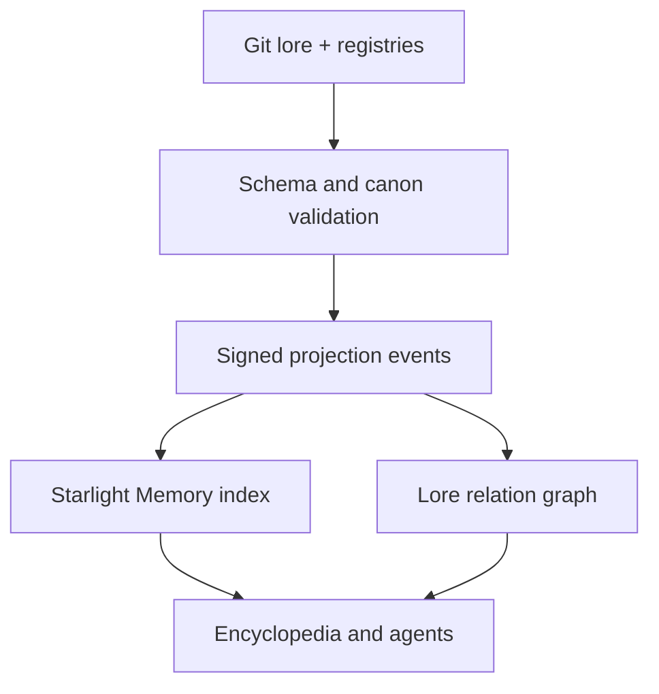

# Starlight Memory Projection for Arcanea Lore

## Decision

Git is the canonical event log. Starlight Memory is a signed, rebuildable read model for semantic recall, relationship traversal, agents, and the encyclopedia.

Memory never decides canon.



## Authority contract

| Concern | Authority |
|---|---|
| exact record content | Git blob at source commit |
| status and canon scope | reviewed Git record |
| semantic retrieval | Starlight Memory projection |
| relationships | projected graph, rebuildable from Git |
| conflict resolution | newest explicitly approved Git revision, never embedding similarity |
| promotion to approved | human review recorded in Git |
| deletion or deprecation | tombstone event derived from Git |

A memory result without `sourceCommit`, `contentHash`, `status`, and `canonScope` is non-authoritative and must not be shown as canon.

## Projection envelope

Each JSONL event emitted by `validate-artifacts.mjs --emit-memory` contains:

```json
{
  "eventType": "lore.entity.upserted",
  "entityType": "artifact",
  "entityId": "aeralith-choir-reed",
  "worldId": "darkenia",
  "canonScope": "world",
  "status": "staging",
  "version": "0.1.0",
  "sourcePath": "magic-intelligence-system/data/artifacts.json",
  "sourceCommit": "git commit SHA or local",
  "contentHash": "sha256:...",
  "namespace": "arcanea.lore.darkenia.artifacts",
  "labels": ["artifact", "wind", "cant"],
  "relations": [],
  "payload": {}
}
```

The payload is the validated source record, not a model summary. Summaries and embeddings are disposable derivatives keyed by the same content hash.

## Event types

- `lore.entity.upserted`
- `lore.entity.approved`
- `lore.entity.quarantined`
- `lore.entity.deprecated`
- `lore.entity.tombstoned`
- `lore.relation.upserted`
- `lore.projection.rebuilt`

The initial generator emits `lore.entity.upserted`; downstream release automation can emit approval and lifecycle events by comparing reviewed revisions.

## Query policy

Default public and agent queries apply:

```text
status = approved
AND canonScope IN (core, requested-world)
AND rights.reviewStatus = cleared
AND memory.project = true
```

STAGING queries require `includeStaging: true` and visible status labels. Experimental and quarantined records require separate explicit flags and cannot be blended into a canonical answer.

Cross-world retrieval must return the artifact's origin world, destination world, import rule, canon scope, and any changed local capability before the description.

## Namespaces

```text
arcanea.lore.core
arcanea.lore.core.artifacts
arcanea.lore.<world-id>
arcanea.lore.<world-id>.artifacts
arcanea.lore.<world-id>.quarantine
arcanea.lore.community.<creator-or-project-id>
```

Namespaces control retrieval, not ownership. Creator, license, remix lineage, and rights fields remain on every record.

## Relation graph

The first edge vocabulary is intentionally small:

- `origin-world`
- `imported-into`
- `uses-domain`
- `requires-rank`
- `made-by`
- `owned-by`
- `component-of`
- `counters`
- `corrupted-from`
- `remix-of`

Unknown edge types remain invalid until added to a versioned registry. This prevents semantic drift through synonyms.

## Projection lifecycle

1. Pull the reviewed Git revision.
2. Validate JSON syntax, schema shape, locked invariants, cross-record references, status, and rights gates.
3. Canonicalize each record and compute SHA-256.
4. Emit projection events with `GITHUB_SHA` when available.
5. Sign the batch at the existing Starlight Memory cloud-projection boundary.
6. Upsert by `(entityType, entityId, version, contentHash)`.
7. Tombstone records absent from the new approved manifest; never hard-delete provenance.
8. Run retrieval tests for status leakage, world leakage, stale hashes, and contradictory authorities.

## Failure behavior

- Validation failure: emit nothing.
- Missing source commit: local development only; public release blocked.
- Hash mismatch: discard projection and rebuild.
- Multiple approved records with the same ID: fail closed and require human reconciliation.
- Memory/Git disagreement: Git wins; projection is deleted and rebuilt.
- Rights status becomes blocked: quarantine the projection immediately while retaining private audit provenance.

## Encyclopedia contract

The encyclopedia renders:

- canonical name, status, scope, world, version, and source revision;
- Element and derived Expression composition;
- discipline, tier, Gate, and rank requirement;
- capabilities, price, limits, failures, and counterplay;
- provenance, bond, agency, combination roles, and relations;
- creator attribution, license, and rights-review state;
- lineage across remixes and revisions.

Power without price is a data-quality failure. Lore without source revision is a trust failure. Memory without rebuildability is not Arcanea canon infrastructure.

